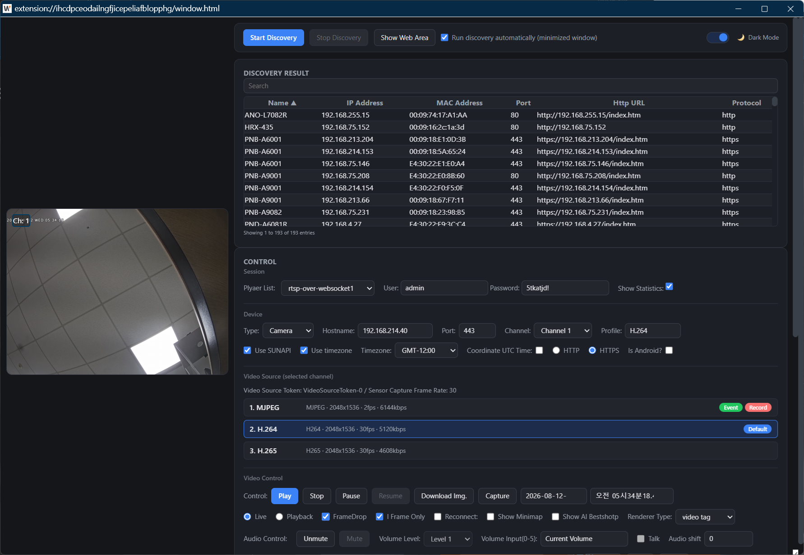
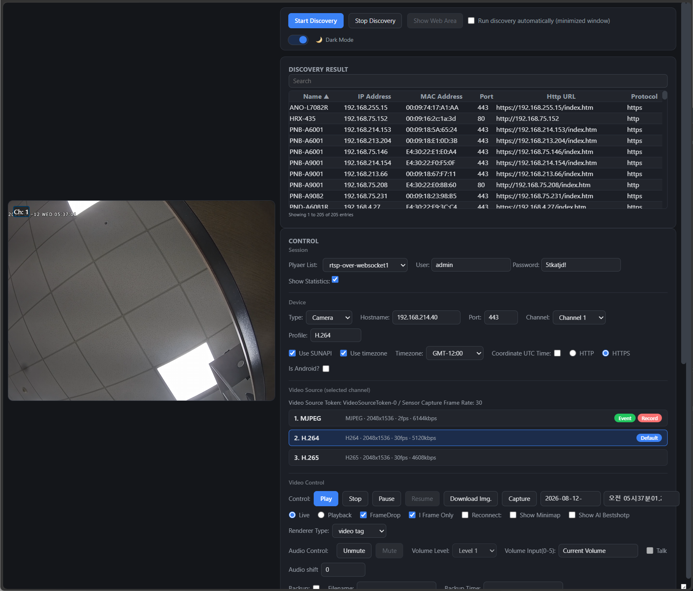

# Hanwha WiseNet IP Camera Discover with Chrome Extension App for Chrome and Chromium Edge Browser
==========================

[](LICENSE.txt)

## How to add chrome extension app
This extension isn't published on the Chrome Web Store (or Edge Add-ons), so it has to be
loaded manually in developer mode:

1. Build it: `npm install && npm run build` (see "Build" below).
2. Open `chrome://extensions` in the address bar (Edge: `edge://extensions`).
3. Turn on **Developer mode** — a toggle in the top-right corner of that page.
4. Click **Load unpacked**, then select **`dist/chrome-extension`** (not the repository
   root) as the folder to load.
5. The extension's icon appears in the toolbar — pin it if it doesn't show automatically,
   then click it to open the popup below.

**After changing anything under `src/`**, re-run `npm run build` and click the reload icon
on this extension's card at `chrome://extensions` to pick up the change.

# Main GUI
If you execute the discovery application, you can see the popup window like this.


This code is very simple example for Hanwha IP Camera discover on Chrome Browser using Chrome Extension API.

## Build

The source lives under `src/` (TypeScript) and compiles to two independent,
self-contained outputs under `dist/` — `dist/chrome-extension/` (load this
unpacked) and `dist/nodejs/` (the standalone `wisenet-udp-discovery`
package). `dist/` is generated and gitignored; run the build after cloning
and again after pulling any change to `src/`:

```bash
npm install
npm run build
```

| script | does |
| --- | --- |
| `npm run build` | compiles both TypeScript targets and assembles `dist/chrome-extension/` + `dist/nodejs/` |
| `npm run build:extension` | just the chrome-extension compile steps — `tsc` for `background.ts`/`socket.ts`, a separate `tsc --noEmit` type-check for `window.ts`, then `vite build` to bundle `window.ts` (+ its `vis`/`moment`/`moment-timezone` imports) into one `window.js` (compile-only, no assembly) |
| `npm run build:node` | just `tsc -p tsconfig.node.json` (compile-only, no assembly) |
| `npm run clean` | removes `dist/` and the `build/` intermediate |
| `npm run start:server` | assembles just `dist/nodejs/` (`node scripts/build.js node`, skipping the chrome-extension side) then runs its [example HTTP(S)/WebSocket server](src/nodejs/README.md#example-server) on `:8080`/`:8443` |

`src/sunapi/` (the shared SUNAPI wire-format implementation) is compiled
once and copied into **both** `dist/chrome-extension/sunapi/` and
`dist/nodejs/sunapi/` — each `dist/` output has to be independently
self-contained (one gets "Load unpacked" or zipped, the other gets
`npm publish`ed), so neither points outside itself at a shared `sunapi/`.
See [src/sunapi/README.md](src/sunapi/README.md).

## Two ways to run UDP discovery

This repository contains **two independent consumers** of the same
SUNAPI UDP discovery protocol — the Chrome extension, and a standalone
Node.js package. They don't depend on each other; they both build on a
shared wire-format implementation instead:

```
                  src/sunapi/  (protocol.ts, request.ts, response.ts)
                       "SUNAPI IP Installer" wire format — build a
                       discovery request, parse a device reply.
                       See src/sunapi/README.md.
                              │
             ┌────────────────┴────────────────┐
             ▼                                  ▼
  Chrome extension                     Node.js standalone package
  src/chrome-extension/native-host/     src/nodejs/udpDiscovery.ts
  wisenet-udp-host.ts                   (require it directly, or run
  (spawned by the extension via          src/nodejs/examples/server.ts)
   native messaging)
```

* **Chrome extension** (`src/chrome-extension/` — `manifest.json`,
  `background.ts`, `native-host/`, `icons/` — plus `src/shared/` —
  `window.html`/`window.ts`/`scripts/socket.ts`/`css/`, shared with the
  Node.js example server below) — a browser extension you load unpacked;
  discovery runs automatically in the background by default. See "Chrome
  extension" below.
* **`src/nodejs/`** — a plain Node.js library/CLI/example-server with no
  browser involved at all, published independently of the extension
  (see [src/nodejs/README.md](src/nodejs/README.md)). Useful for running
  discovery from a server, a script, or just trying it out without
  installing the extension. See "Node.js standalone discovery" below.

Files (paths below are the `src/` source; see "Build" above for what each
compiles to under `dist/`):

* `src/chrome-extension/manifest.json`: setting for environment for extension app.
* `src/chrome-extension/background.ts`: Manifest V3 service worker. Runs
  automatic discovery directly, with no window at all, unless turned off
  (see below); also opens/focuses window.html on request (toolbar icon,
  right-click menu, or an external message) for manual use.
* `src/shared/scripts/socket.ts`: talks to the native host (extension) or
  a WebSocket (Node.js example server) and forwards/displays results — no
  packet parsing happens here anymore (see below). See
  [docs/architecture.md](docs/architecture.md) for how this one file
  serves both consumers.
* `src/chrome-extension/native-host/`: native messaging host that
  performs the UDP broadcast and parses replies (see below).
* `src/sunapi/`: the SUNAPI IP Installer wire-format implementation
  (request building + response parsing), shared by `native-host/` and
  `src/nodejs/` — see [src/sunapi/README.md](src/sunapi/README.md).
* `src/nodejs/`: a standalone Node.js port of the discovery protocol,
  published independently of this extension — see
  [src/nodejs/README.md](src/nodejs/README.md).
* `src/shared/window.ts`: GUI script for window.html.
* `src/shared/window.html`: GUI — optional; only needed if you want to
  see discovery results or run discovery manually (see below).

## Chrome extension: Manifest V3 architecture (UDP via native messaging)

`chrome.sockets.udp` was a Chrome Apps API and is not available to
Manifest V3 extensions. A Manifest V3 service worker also can't parse
SUNAPI's binary reply format itself (no DOM, and no reason to duplicate
that logic browser-side either), so both the UDP transport *and* the
packet parsing are delegated to a native messaging host, which hands the
extension an already-parsed device object:

```
src/chrome-extension/native-host/wisenet-udp-host.ts (Node.js)
  ├─ broadcasts the discovery request to 255.255.255.255:7701 (src/sunapi/request.ts)
  ├─ parses every reply on :7711 (src/sunapi/response.ts)
  └─ relays each parsed device object to the extension over native messaging
       │
       ▼
src/shared/scripts/socket.ts — forwards to every ID in
src/shared/scripts/player-extension-ids.json, and, if window.html is
open, displays it in the table
```

#### Forwarding results to other "player" extensions

`socket.ts` also forwards each discovered device (and a `{launch: true}`
ping on `start()`) to a configurable list of other extension IDs — e.g. a
separate camera-player extension that wants to react to discoveries from
this one, without polling. That list lives in
[`src/shared/scripts/player-extension-ids.json`](src/shared/scripts/player-extension-ids.json):

```json
{
	"player_extension_ids": [
		"knldjmfmopnpolahpmmgbagdohdnhkik",
		"cgjnljkgkhlalpippgcamfefhfbkbnid",
		"aleblbammdopgjlaainhggebjfgfkpdf"
	]
}
```

Add, remove, or edit IDs there and rebuild (`npm run build` or `npm run
build:extension`) — `socket.ts` itself declares
`playerExtensionIds: __PLAYER_EXTENSION_IDS__` (a placeholder token, not
a real identifier); `scripts/substitute-player-extension-ids.js` reads
this JSON file and substitutes the real array into the compiled
`socket.js` as part of the build, the same template-substitution idiom
the native-host install scripts use for `@HOST_PATH@`/`@EXTENSION_ID@`.
This forwarding is optional and best-effort — `chrome.runtime.sendMessage`
to an ID that isn't installed is caught and ignored (see `socket.ts`'s
`start()`/`onDevice()`), so an empty or partly-stale list is harmless.

### Automatic vs. manual discovery

Discovery can run two ways, controlled by the **"Run discovery
automatically"** checkbox in `window.html` (persisted to
`chrome.storage.local` as `autoDiscoveryEnabled`, on by default):

* **Automatic (default).** `background.js` calls `socket.start()` directly
  in the service worker as soon as the browser starts — no window is ever
  created for this. A native-messaging port counts as active work for the
  service-worker lifecycle, so it isn't torn down by Chrome's normal idle
  timeout while connected. Opening `window.html` while this is on just
  shows results as they arrive; its own Start/Stop buttons stay disabled
  since there's nothing for them to do.
* **Manual (checkbox off).** Open the window from the toolbar icon and
  click **Start Discovery** yourself, same as the original behavior.

#### Showing/hiding window.html

`window.html` is just a normal window, independent of which discovery
mode is active:

* **Show it**: click the toolbar icon, or right-click it →
  **"Open Wisenet IP Installer window"** — both do the same thing
  (`openAppWindow()` in `background.js`), and either one focuses the
  existing window instead of opening a second one if it's already open.
  This works the same way in automatic and manual mode; there's no mode
  where the icon click is suppressed.
* **Hide it**: just close the window normally. In automatic mode this has
  no effect on discovery — it keeps running in the service worker either
  way, since it was never tied to the window in the first place. In
  manual mode, closing the window also ends that discovery session (same
  as clicking **Stop Discovery**), since manual mode's `socket` instance
  lives in `window.html` itself.

### Setup

1. Build first: `npm install && npm run build` (see "Build" above) —
   produces `dist/chrome-extension/`.
2. Load the extension from `chrome://extensions` (Developer mode → Load
   unpacked → **`dist/chrome-extension`**, not the repository root) and
   copy its **extension ID** (shown on the extension's card).
3. Register the native host with that extension ID:
   * Windows: `powershell -ExecutionPolicy Bypass -File dist/chrome-extension/native-host/install-host.ps1 <extension-id>`
   * macOS/Linux: `./dist/chrome-extension/native-host/install-host.sh <extension-id>`

   This generates the host manifest (from
   [src/chrome-extension/native-host/com.wisenet.ipinstaller.json.template](src/chrome-extension/native-host/com.wisenet.ipinstaller.json.template))
   at a stable location *outside* `dist/` — `%LOCALAPPDATA%\WisenetIPInstaller\native-host\`
   on Windows, `~/.config/google-chrome/NativeMessagingHosts/` on
   macOS/Linux — and registers it with the browser. **That generated file
   is machine-specific (your local path + extension ID) and is never
   committed; everyone who sets this extension up generates their own.**
   Deliberately kept outside `dist/`, so unlike the executable it points
   at, it survives `npm run clean` / `npm run build` — no need to re-run
   the install script after every rebuild, only if the extension ID
   changes or you move/re-clone the repo. See
   [src/chrome-extension/native-host/README.md](src/chrome-extension/native-host/README.md)
   for what it contains, how to redo it by hand if you'd rather not run
   the script, and the full native-messaging protocol.
4. Restart Chrome (native messaging host registrations are only read at
   browser startup). Discovery then starts automatically — open the
   toolbar icon's right-click menu → **"Open Wisenet IP Installer
   window"** any time to see results, or to turn automatic mode off if
   you'd rather drive discovery manually with the **Start Discovery**
   button.

The native host requires [Node.js](https://nodejs.org/) available in `PATH`.

**After changing anything under `src/`**, re-run `npm run build` and
reload the extension (`chrome://extensions` → the reload icon on this
extension's card) to pick up the change — `dist/chrome-extension` is a
generated snapshot, not something Chrome watches for edits.

## Node.js standalone discovery

`src/nodejs/` (ships built as `dist/nodejs/`) is a separate way to run the
same discovery protocol with no browser or extension involved at all — a
library (`UDPDiscovery`), a CLI (`node index.js`), and an example
HTTP(S)/WebSocket server serving the same shared discovery UI the Chrome
extension uses (see [docs/architecture.md](docs/architecture.md)). See
[src/nodejs/README.md](src/nodejs/README.md) for the full API, but the
quick path:

```bash
npm install && npm run build   # from the repository root — see "Build" above
cd dist/nodejs
npm install                    # pulls in the ws devDependency the example server needs
npm run example:server
# then open http://localhost:8080/ and click "Start Discovery"
```



Same `window.html`/`window.ts` UI as the Chrome extension above, served over
HTTP(S) + WebSocket instead of `chrome.runtime`/`chrome.storage` — see
[docs/architecture.md](docs/architecture.md) for how `socket.ts`'s
`IS_EXTENSION` check picks the right transport for each.

`dist/nodejs/` is self-contained (its own `package.json`, its own copy of
`sunapi/`) — it's the thing that actually gets `npm publish`ed, and the
one to point other projects' `package.json` at (e.g. via a `file:` or
`git` dependency) if you want to consume this as a library.

**Changing the port(s)** — `HTTP_PORT`/`HTTPS_PORT` (`:8080`/`:8443` by
default) aren't hardcoded; set them either as real env vars
(`HTTP_PORT=3000 npm run example:server`) or via a `.env` file:

```bash
cd dist/nodejs
cp .env.example .env   # the build copies .env.example here for you
# edit .env, e.g. uncomment/set HTTP_PORT=3000 and HTTPS_PORT=3443
npm run example:server
```

`.env` must live in the directory you *run the server from* — `dist/nodejs/`
for the `cd dist/nodejs && npm run example:server` flow above, since that's
`process.cwd()` at that point. It's gitignored and lives inside `dist/`, so
`npm run clean`/a rebuild wipes it — that's expected (`dist/` is pure build
output); keep your `.env` outside `dist/`, or just re-`cp` it after a clean.
Real env vars always win over `.env`'s values. See
[src/nodejs/README.md](src/nodejs/README.md#example-server) for details.

**If you're on WSL (Windows Subsystem for Linux), run this on Windows
directly, not inside WSL bash.** WSL2's virtual/NAT network doesn't sit
on the same broadcast domain as your physical LAN, so the UDP broadcast
either doesn't reach real devices or their replies don't route back —
`dgram` reports success (no bind/send error) either way, it just finds
nothing (`{"devices":[]}`). This is exactly why the Chrome extension's
native host has to be registered as a Windows process too (see the
Chrome extension section above) — same underlying constraint.

### note

Now, you can't send broadcast message on chrome app. Because chrome.socket api hasn't setsockopt function.

- https://code.google.com/p/chromium/issues/detail?id=125586
- http://civic.xrea.jp/2013/04/09/chrome-app-udp-broadcast/

This UI include datatable ui from
https://cloudtables.com/

If you want to use this UI, you have to follow license policy from CloudTables.
