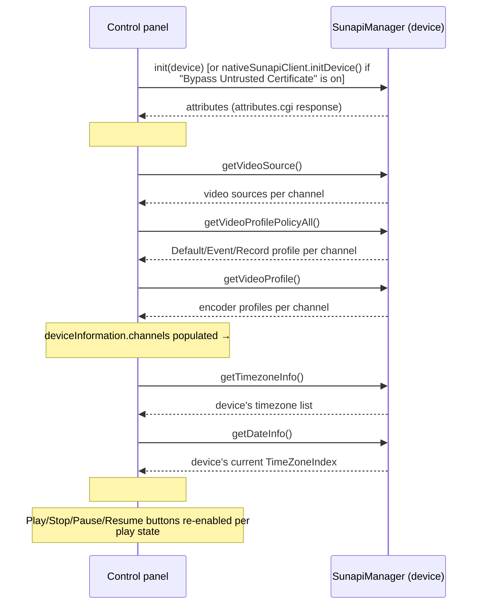

# Control panel data binding: device selection & SUNAPI response

| | |
|---|---|
| Title | Control Panel Data Binding — Device Selection & SUNAPI Response |
| Abstract | Field-by-field spec of four existing `window.ts` behaviors that populate the Control panel automatically: discovered-device selection, Player List selection, SUNAPI On/Off, and video profile selection. |
| Status | Implemented |
| Component | `src/shared/` (`window.ts`) |
| Author | Youngho Kim |
| Milestone | Unreleased (post v1.0.2) |
| Related docs | [../architecture.md](architecture.md) |

## History

| Version | Date | Author | Description |
|---|---|---|---|
| 1.0 | 2026-08-28 | Youngho Kim | Initial documentation of discovered-device selection and SUNAPI On/Off Control-panel data binding. |
| 1.1 | 2026-08-28 | Youngho Kim | Added §2 Player List selection; added Title/Abstract/Author/Milestone/History metadata. |
| 1.2 | 2026-08-28 | Youngho Kim | Added §4 Video profile selection, including what the Default/Event/Record badges mean and the profile-click-doesn't-update-the-player gap found while documenting it. |
| 1.3 | 2026-08-28 | Youngho Kim | Corrected §2: `on_player_select()` is also called once, unconditionally, at the end of `window.ts`'s second `DOMContentLoaded` listener — `selected_player_id` is not actually `null` after page load in practice, as this doc previously said. Found while writing `docs/window-ui/`'s full-file SRS. |

## Purpose

Documents four existing (already-implemented) `window.ts` behaviors that populate/change the
**Control** panel's UI fields automatically, as opposed to the user typing into them directly:

1. **Selecting a discovered device** (a Discovery result table row, or a Star Topology leaf node) —
   stages connection fields for a device that isn't connected yet.
2. **Selecting a different entry in the "Plyaer List:" dropdown** (`#player_list`) — switches which
   already-existing `<rtsp-over-websocket>` element the Control panel reads/writes, and fills the
   fields from *that element's own current state* (no network request of its own).
3. **Turning "SUNAPI:" On** — the device's own SUNAPI `/stw-cgi/attributes.cgi` response (and the
   follow-up video-source/profile/timezone calls it triggers) drives several Control fields.
4. **Selecting a row in the Video Source (selected channel) Profile List** — sets which encoder
   profile `#profile` reflects, from the channel's already-cached (§3) profile data.

**§1 and §2 are easy to conflate** ("selecting a camera") but are genuinely different: §1 picks a
*newly discovered, not-yet-connected* device and stages fresh connection info for it; §2 switches
between `<rtsp-over-websocket>` elements that already exist in the page (today there's only one,
`rtsp-over-websocket1`, but the dropdown is built from `document.querySelectorAll("rtsp-over-websocket")`
so the mechanism already supports more) and reads *that element's own already-set* attributes back
into the Control panel — no discovery data involved.

All four are read/write-existing-behavior specs, not new components — see
[`docs/switch-component/`](switch-component/)/[`docs/disclosure-component/`](disclosure-component/)
for this UI's actual reusable components. This doc exists purely to make these four non-obvious
data flows discoverable without having to trace the whole promise chain in `window.ts` by hand.

## 1. Device selection → Control panel (`applyDiscoveredDeviceSelection()`)

### Trigger points

Both funnel through the same function, `applyDiscoveredDeviceSelection(row_data)` (`window.ts`) —
see `docs/architecture.md`'s "Discovery result views" section for the shared `dataSet` shape this
reads from (`row_data` is one `dataSet` row: `[Name, IPAddress, MACAddress, Port, URL, Protocol]`):

- Clicking a row in the Discovery result **Table** view.
- Clicking a leaf node in the **Star Topology** view (hub nodes are excluded — they're a derived
  grouping, not a selectable device; see `docs/star-topology/`).

### What changes

| Field | New value | Note |
|---|---|---|
| Current player | stopped if playing | `getSelectedPlayer().stop()` first, so a newly-selected device never starts from a stale playing session |
| `#use_sunapi_client_checkbox` (SUNAPI switch) | forced **Off** if it was on | also nulls `getSelectedPlayer().sunapiClient` — a new device has no SUNAPI session yet |
| `#is_android` | forced **Off** if it was on | also clears `getSelectedPlayer().android` |
| `#hostname` | `row_data[1]` (discovered IP) | also sets `getSelectedPlayer().hostname` |
| `#port` | `row_data[3]` (discovered port) | also sets `getSelectedPlayer().port` |
| `#http_radio`/`#https_radio` | set from `row_data[5]` (discovered Protocol) | set via `.checked =`, **not** `.click()` — deliberately does not fire `changehttptype()`'s `change` listener, so its 80/443 default-port side effect doesn't immediately overwrite the real discovered port set just above |
| `#use_native_tls_proxy_checkbox` ("Bypass Untrusted Certificate") | **On** if the discovered protocol is HTTPS, **Off** if HTTP | an HTTPS device found via SUNAPI discovery is likely a self-signed factory cert (see `docs/native-https-proxy/PRD.md`); still fully opt-out via the checkbox itself. Has no effect outside the extension target (native-host-only feature) |
| `#webviewer` (the "Show Web Area" `<webview>`) | `.src = row_data[4]` (discovered URL) | |
| `#web` button | enabled | was disabled until a device was selected |

No SUNAPI request is made by this step — it only stages the connection fields. SUNAPI On (§3) is a
separate, explicit step the user takes afterward (or was already on for a *previous* device, in
which case this selection just turned it back off, per the table above).

## 2. Player List selection → Control panel (`on_player_select()`)

### Trigger point

Changing the **"Plyaer List:"** `<select id="player_list">` (`window.ts`'s `on_player_select()`,
wired to its `change` event) — **and also once automatically at page load**: `window.ts` has two
separate `DOMContentLoaded` listeners (the first builds `#player_list` — one `<option>` per
`<rtsp-over-websocket>` element found via `document.querySelectorAll("rtsp-over-websocket")`,
`value`/text = the element's own `id`; the second, unrelated to Player List setup itself, ends with
an unconditional `on_player_select();` call). Since the first listener has already run by the time
the second one's body executes (`DOMContentLoaded` listeners fire in registration order),
`#player_list` already has its first `<option>` selected at that point, so this startup call seeds
`selected_player_id` from it immediately — `getSelectedPlayer()` is **not** `null` after page load
in practice (this doc previously said otherwise; corrected here). The `!== null` guards several call
sites still carry (e.g. `onchangeusername`/`onchangepassword`) remain correct defensive code for the
theoretical case of a page with zero `<rtsp-over-websocket>` elements (`#player_list` would then have
no options, `.value` would be `""`, and `document.getElementById("")` returns `null`) — window.html
always ships with at least one, so that case doesn't occur today, but the guards aren't dead code.

### What changes

Unlike §1/§3, nothing here is read from the network — every field is read directly off the
selected `<rtsp-over-websocket>` element's own already-set JS properties/attributes.

> Several of the `if` guards in `on_player_select()`'s source (of the shape `typeof x !==
> 'undefined' || x == null || x == ''`) are effectively always true for any value `x` can actually
> hold (a defined value makes the first clause true; `undefined`/`null` make the second clause
> true via loose equality) — worth knowing if you're reading the source directly, since the table
> below describes what happens in practice (the assignment always runs), not what the `if` looks
> like it's guarding.

| Field | New value | Note |
|---|---|---|
| `#user` (username/password prompt block) | shown if the player has no `username`/`password` set yet, hidden otherwise | if hidden (credentials already present) **and** SUNAPI is already On, also re-triggers `initSunapiManager()` for the newly selected player |
| `#username`, `#password` | player's own `.username`/`.password` | |
| `#channel` | player's own `.channel` | set unconditionally, before the device-info block below |
| `#statistics` | player's own `.statistics` | |
| `#device` (Device fields block) | shown, then populated (see below) — in practice this branch is the one that always runs, per the guard note above | |
| `#device_type` | NVR (index 1) or Camera (index 0) from player's `.device` | |
| `#hostname` | player's own `.hostname` | |
| `#port` | player's own `.port` | |
| `#channel` | player's own `.channel` again | same field as above, re-set inside this block too |
| `#profile` | player's `.profile_number`, then overwritten by player's `.profile` if that's also set | the `.profile` assignment runs second, so it wins whenever both are present |
| `usegmttime` | — | dead reference — no such element exists in `window.html` (same pre-existing class of issue as `MEMORY.md`'s `#broadcast`/`#usegmttime` entry); guarded with a `!== null` check so it's a harmless no-op today, not a crash |
| Play/Stop/Pause/Resume buttons | Play enabled, Stop/Pause/Resume disabled | the guard around this (checking the player's `sunapiClient`) is also in the always-true class above, so this is what actually runs in practice; the "else" branch that would otherwise react to an existing `sunapiClient` is dead/commented-out code |

## 3. SUNAPI On/Off → Control panel (`initSunapiManager()`)

### Trigger points

- Checking **"SUNAPI:" On** (`on_change_use_sunapi_client()`, wired to the switch's `click`).
- Automatically **re-triggered** while SUNAPI is already On, whenever `#port` or the HTTP/HTTPS
  protocol changes (`changeport()`/`changehttptype()`) — keeps the SUNAPI session pointed at
  whatever connection fields are currently set, re-fetching everything below from scratch.

### Turning On: the request chain and what each step changes

| Step | Field(s) changed | Detail |
|---|---|---|
| `init()`/`initDevice()` resolves with `attributes` | — | `deviceInformation.attributes = attributes`; logged to Debug Information (`changedebug()`) |
| | `#is_android` | `= attributes.IsAndroid` (also `getSelectedPlayer().android`) |
| | `#use_gmt` (enabled/disabled) | `applySearchByUTCTimeCapability(attributes)` — reads the `SearchByUTCTime` capability (via `getCapabilityValue()`, handles both JSON-object and raw-XML-string `attributes` shapes — see `docs/architecture.md`'s note on this). If unsupported, disables `#use_gmt` and force-unchecks it (calling `changeusegmt()`, which also disables `#timezone` and clears `getSelectedPlayer().GMT`) when it was previously checked |
| `getVideoSource()` → `getVideoProfilePolicyAll()` → `getVideoProfile()` | `deviceInformation.channels` | Each response is merged onto the per-channel array by `Channel` index; only once all three have resolved does `populateChannelSelect()` run |
| `populateChannelSelect()` | `#channel` | Converted from a plain text `<input>` to a `<select>` (`setChannelWidgetMode(true)`) and populated with one `<option>` per channel (1-based numbering — SUNAPI itself is 0-based, `+1`'d for the dropdown/player, consistent with this app's existing 1-based convention elsewhere) |
| | `#video_source_summary`, `#video_profile_list` | `renderVideoProfileInfo()` — summary text (Video Source Token / Sensor Capture Frame Rate) and a clickable profile list (Default/Event/Record badges — see §4 for what they mean) for whichever channel is currently selected; clicking a row sets `#profile` (§4) |
| `getTimezoneInfo()` | `deviceInformation.timezoneList` | no UI change yet, cached for the next step |
| `getDateInfo()` (camera devices only) | `#use_gmt`, `#timezone` | If not already checked, checks `#use_gmt` and enables `#timezone`; parses the device's own current `TimeZoneIndex` into a GMT hour offset and sets both `getSelectedPlayer().GMT` and `#timezone`'s value to it — this is the device's *actual* reported timezone, not a user guess |
| Final `.then()` | Play/Stop/Pause/Resume buttons, `#volume`/`#getaudiovolume` (if already playing), `#use_sunapi_client_checkbox` | Button `disabled` states set from `getSelectedPlayer().isplay`; if a player is already playing, `#volume`/`#getaudiovolume` are read from it. `#use_sunapi_client_checkbox` is set **checked** here — this is the actual On confirmation, not the initial click (which only triggers the attempt) |
| `.catch()` (any step fails) | `#use_sunapi_client_checkbox` | force-unchecked, with an error popup — SUNAPI On never stays "on" after a failed request chain |

### Turning Off (`on_change_use_sunapi_client()`, unchecked branch)

| Field | New value |
|---|---|
| `getSelectedPlayer().sunapiClient` | `null` |
| `#channel` | reverted to a plain text `<input>` (`setChannelWidgetMode(false)`) — no more SUNAPI channel list to choose from |
| `deviceInformation.channels` | `undefined` |
| `#video_source_summary`/`#video_profile_list` | cleared (`renderVideoProfileInfo()` with no cached channels shows "No video source information yet — check \"Use SUNAPI\" first.") |

## 4. Video profile selection → Control panel (`renderVideoProfileInfo()`'s row click)

### Trigger point

Clicking a row in `#video_profile_list` (the "Video Source (selected channel)" panel), populated by
`renderVideoProfileInfo()` — see §3's `populateChannelSelect()` row for when that function first
runs. It also re-runs (re-rendering the same list from already-cached data, no network request)
whenever the channel selection changes (`changechannel()`) or SUNAPI is turned Off (§3's Turning
Off table).

### What the Default/Event/Record badges mean

Each profile row can carry up to three badges, one per field on the channel's cached
`ProfilePolicy` (from §3's `getVideoProfilePolicyAll()` response — SUNAPI's video profile *policy*,
distinct from the profile's own encoding parameters):

| Badge | `ProfilePolicy` field | Meaning |
|---|---|---|
| `Default` | `DefaultProfile` | This profile number is the device's default **live view** profile. |
| `Event` | `EventProfile` | This profile number is what the device switches to (or uses) for **event-triggered** recording (motion/AI detection, etc.). |
| `Record` | `RecordProfile` | This profile number is used for the device's **continuous/scheduled** recording. |

A single profile can carry more than one badge at once (e.g. the same profile can be both the
default live-view profile and the continuous-recording profile) — `renderVideoProfileInfo()` checks
all three fields independently (`profile.Profile === policy.DefaultProfile`, etc.), not
mutually-exclusively. A profile with none of the three fields matching its number gets no badge —
it's simply one of the device's other available encoder profiles (see the `EncodingType`/
`Resolution`/`FrameRate`/`Bitrate` summary line already shown for every row regardless of badges).

### What changes on click

| Field | New value | Note |
|---|---|---|
| `#profile` | `.value = profile.Name` | Set directly via JS (`(el as HTMLInputElement).value = ...`), **not** via a simulated click/keyboard entry. |
| Clicked row | gains `.selected`; every other row loses it | Purely visual — highlights which profile `#profile` currently reflects. |

**Gap found while documenting this**: setting `.value` directly does **not** fire the `<input>`'s
native `change` event, so `changeprofile()` — the function wired to `#profile`'s `change` listener,
which is what actually writes `getSelectedPlayer().profile`/`.profile_number` — does **not** run as
a result of this click. The visible field and the `.selected` highlight update immediately, but the
*player's own* profile property is only updated if `change` fires some other way afterward (e.g.
the user manually focuses and blurs the field). In practice this means clicking a profile row and
then immediately pressing Play can start playback using whichever profile was set **before** the
click, not the one just selected in the list. Flagged here as a known behavior gap found while
writing this doc — documented, not fixed; the user asked for the data-binding spec to be recorded,
not for a code change.

## Interaction between the four triggers

Selecting a *different* discovered device (§1) while SUNAPI is On turns it back Off (§1's table)
rather than silently re-running the whole chain against the new device — the user has to
explicitly turn SUNAPI back On for the newly-selected device, same as they did for the first one.
`changeport()`/`changehttptype()` are the only two places that *automatically* re-run the SUNAPI
chain, and only because they're edits to the connection itself (not a new device selection) while
SUNAPI is already known to be On; §2 (Player List selection) also re-triggers it, for the same
reason — switching players is effectively switching which connection's settings are "current".

§4 (video profile selection) is downstream of §3, not a peer trigger for anything else: it only
ever reads from `deviceInformation.channels`, already cached by §3, and never itself triggers a
SUNAPI request. Changing the selected channel (`changechannel()`) re-runs §4's rendering against
the newly selected channel's already-cached profiles — including re-evaluating which row (if any)
gets `.selected`, based on whatever `#profile` currently holds (which may be stale from a different
channel, per §4's own click-vs-`change`-event gap above).

## Files

- `src/shared/window.ts` — `applyDiscoveredDeviceSelection()`, `on_player_select()`,
  `on_change_use_sunapi_client()`, `initSunapiManager()`, `setChannelWidgetMode()`,
  `populateChannelSelect()`, `renderVideoProfileInfo()` (and its row-click handler, §4),
  `changeprofile()` (wired to `#profile`'s `change` event — see §4's gap), `applySearchByUTCTimeCapability()`,
  `changeport()`/`changehttptype()`/`changechannel()` (the re-trigger-while-On call sites).
- `src/shared/window.html` — the Control panel fields listed in the tables above.
