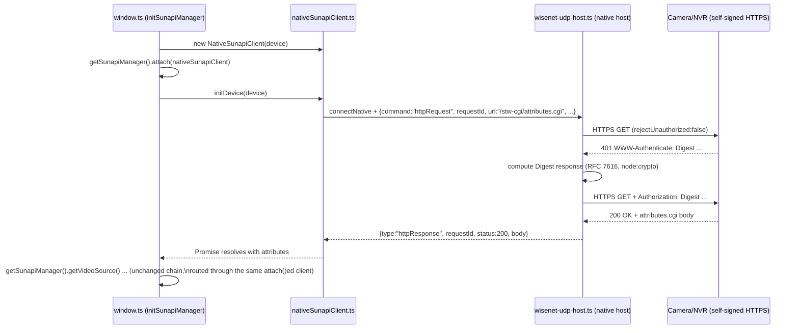
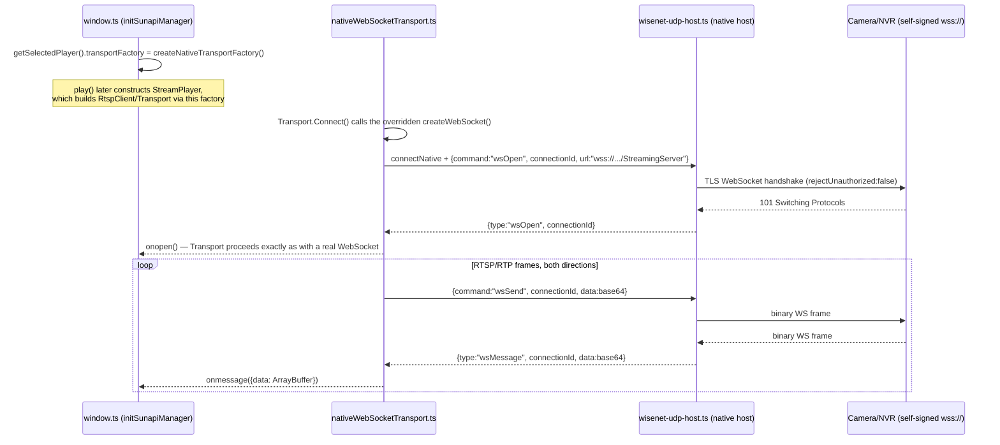

# DESIGN — Native-Host HTTPS Proxy for Untrusted Camera Certificates

| | |
|---|---|
| Title | Native-Host HTTPS Proxy for Untrusted Camera Certificates — Design Document |
| Abstract | `SunapiManager.attach()`/`Transport.createWebSocket()` feasibility findings, the request/streaming architecture, security design, and alternatives rejected. |
| Status | Implemented |
| Author | Youngho Kim |
| Milestone | v1.0.2 |
| Related docs | [PRD](PRD.md) · [MRD](MRD.md) · [SRS](SRS.md) · [TC](TC.md) |

## History

| Version | Date | Author | Description |
|---|---|---|---|
| 1.0 | 2026-08-26 | Youngho Kim | Initial DESIGN for the native-host HTTPS proxy feature. |
| 1.1 | 2026-08-28 | Youngho Kim | Added Title/Abstract/Author/Milestone/History metadata. |

## Feasibility finding: `SunapiManager.attach()` is a supported extension point

The vendored `@melchi45/rtsp-over-websocket` package's `SunapiManager` class
(`window.SunapiManager`, exposed to `window.ts` via `legacy-globals-bridge.js`) already has a
public seam for exactly this kind of substitution — confirmed against its shipped
`dist/types/network/http/SunapiManager.d.ts`:

```ts
interface SunapiClientLike {
  get(uri, jsonData, successFn, failFn, scope, isAsyncCall?, isText?, withoutSeqId?): void;
  post?(...args): void;
  setTimeout(timeout: number): void;
  getAuthInfo(): unknown;
}
declare class SunapiManager {
  get sunapiClient(): SunapiClientLike | null;
  set sunapiClient(v: SunapiClientLike | null);
  getSunapiClient(): SunapiClientLike | null;
  attach(v: SunapiClientLike): void;
  dettach(): void;
  init(info: SunapiManagerDeviceInfo): Promise<unknown>;
  getVideoSource(): Promise<unknown>;
  // ...getDeviceInfo, getVideoProfilePolicyAll, getTimezoneInfo, getDateInfo, etc.
}
```

Every SUNAPI method other than `init()` calls `this._sunapiClient.get(...)` through a private
`request()` helper — so once a `SunapiClientLike` is `attach()`ed, `window.ts`'s existing
`.then()` chain in `initSunapiManager()` needs **no changes** for anything after the first call.

**The one wrinkle**: `SunapiManager.init()` itself always constructs its own internal,
browser-XHR-based client (`XO`, minified as `class XO { constructor(e, n = () => new
XMLHttpRequest())` in the bundled `rtsp-over-websocket.esm.js`) and performs the first
`/stw-cgi/attributes.cgi` GET **before returning**, ignoring anything already `attach()`ed. So the
native-proxy path cannot call `SunapiManager.init()` at all — `NativeSunapiClient.initDevice()`
(`src/shared/scripts/nativeSunapiClient.ts`) replicates `init()`'s few lines of device
normalization and issues that first GET itself, then `window.ts` calls
`getSunapiManager().attach(nativeSunapiClient)` so every later call in the chain transparently uses
it.

This means the feature needs **no fork of the vendored package and no monkey-patching of global
`XMLHttpRequest`** — see "Alternatives rejected" below for why that mattered.

## Second feasibility finding: `Transport.createWebSocket()` for the streaming connection

The SUNAPI REST proxy above doesn't touch the actual video streaming connection —
`<rtsp-over-websocket>` opens `wss://<camera>/StreamingServer` as a plain browser `WebSocket`
directly, which is independently subject to the same TLS validation. Confirmed against a real
device: `ws://` works, `wss://` fails, and — unlike the SUNAPI case — registering a manual browser
certificate exception for the same host (visiting its `https://` URL and clicking through the
warning) did **not** make the `wss://` connection start working either, so this needed its own fix
rather than being covered by that workaround.

The vendored package has the same kind of seam here too, one layer short of reachable:

- `Transport.createWebSocket(serverAddr)` (`src/player/network/transport/Transport.ts:342-344` in
  the package source) is a `protected` method whose own doc comment already says *"Overridable
  factory so tests can inject a fake socket instead of opening a real connection."* `Transport` and
  its `WebSocketLike` interface are already exported from the package's public entry point.
- `StreamPlayer`'s constructor already accepts an optional `transportFactory` (4th parameter),
  defaulting to `(serverAddr) => new Transport(serverAddr)` inside `RtspClient`.
- The one gap: the custom element's `play()` called `new StreamPlayer(this.info, sunapiClient)` —
  never passing a `transportFactory` through, and nothing on the element exposed a way to supply
  one from outside.

Unlike the SUNAPI case, this gap **did** need a small, additive change to the vendored package
(the user's own — not a fork of a third-party dependency): a `transportFactory` getter/setter on
`RTSPOverWebSocket`, mirroring the existing `sunapiClient` property's pattern immediately above it
in the source, threaded through to the one `new StreamPlayer(...)` call site in `play()`. Nothing
about `Transport`'s own RTSP/RTP interleaved-frame demultiplexing needed to change or be
reimplemented — `NativeTransport` (see below) subclasses the real `Transport` and overrides only
`createWebSocket()`, inheriting everything else.

## Architecture



Streaming (independent of the SUNAPI flow above — set once before the first `play()`):



### Components

- **`src/chrome-extension/native-host/wisenet-udp-host.ts`** — extended with one new command,
  `httpRequest`, alongside its existing UDP-discovery `start`/`broadcast`/`stop`. Same process,
  same registration (`com.wisenet.ipinstaller`) — see [SRS.md](SRS.md)'s NFR-4. Implementation:
  Node's `https`/`http` modules with `rejectUnauthorized: false` for the HTTPS case (this process
  runs outside the browser's trust store entirely; that flag affects only requests this host
  itself makes), plus a from-scratch RFC 7616 Digest implementation using `node:crypto` (the
  vendored package's own digest logic — `XO.digestSchema`/`setDigestHeader` — is a private,
  minified internal of that package and not exported for reuse). An IP-literal allowlist
  (`isAllowedProxyHost`) rejects anything that isn't a private/loopback/link-local address before
  a request is attempted — see [SRS.md](SRS.md) NFR-2.

- **`src/shared/scripts/nativeSunapiClient.ts`** (new) — the `SunapiClientLike` implementation.
  Vite-bundled into `window.js` via a real `import` in `window.ts` (unlike `socket.ts`, which stays
  a classic global script for `background.ts`'s `importScripts()` — this class only ever runs in
  `window.html`'s own context, never the service worker, so it has no reason to share that
  constraint). Opens its own `chrome.runtime.connectNative(socket.HOST_NAME)` port — deliberately
  separate from `background.ts`'s long-lived discovery port (`socket.hostPort`), so its lifecycle
  (opened when the checkbox path first runs, closed and replaced on the next `initSunapiManager()`
  run) is independent of discovery — see [SRS.md](SRS.md) NFR-5. Tracks in-flight requests in a
  `Map<requestId, {successFn, failFn}>`.

- **`src/shared/window.ts`** — `initSunapiManager()` branches once, at the top, on
  `use_native_tls_proxy_checkbox`'s checked state (only meaningful when `IS_EXTENSION`, per
  [SRS.md](SRS.md) FR-2), choosing between the existing `getSunapiManager().init(device)` call and
  `nativeSunapiClient.initDevice(device)` + `attach()`. Everything from `.then(attributes => {...`
  onward is the pre-existing chain, unmodified. A module-level `nativeSunapiClient` variable
  (mirroring the existing `sunapiManager` singleton-per-selected-player comment just above it) is
  closed and replaced on each run, so a stale native port from a previous device never lingers.

- **`src/shared/window.html`** — one new checkbox, `use_native_tls_proxy_checkbox`, in a
  `native_tls_proxy_field` div next to the existing HTTP/HTTPS radio buttons; hidden via
  `style.display = "none"` outside the extension.

- **`wisenet-udp-host.ts`** (streaming) — the same file, extended again with `wsOpen`/`wsSend`/
  `wsClose`, using the `ws` npm package (Node has no built-in WebSocket *client*) with
  `rejectUnauthorized: false` and the same `isAllowedProxyHost` allowlist as `httpRequest`. Binary
  frames cross native messaging base64-encoded (JSON-only protocol) in both directions.

- **`src/shared/scripts/nativeWebSocketTransport.ts`** (new) — `NativeWebSocketLike implements
  WebSocketLike`, one dedicated native-messaging port per active stream (mirrors
  `nativeSunapiClient.ts`'s own choice to keep its port separate from `background.ts`'s discovery
  port). `NativeTransport extends Transport` (the real class, reached via the ambient `Transport`
  global set by `legacy-globals-bridge.js` — see that file's own comment — rather than a real ES
  `import`, for the same CSP/Worker-asset re-inlining reason `nativeSunapiClient.ts` never imports
  the vendored package as a value; `import type` for the `WebSocketLike`/`TransportFactory`
  *types* is fine and used freely, since types are fully erased before Vite's bundler runs and
  carry no re-inlining risk — only a value import pulls real code into the bundle).

  **Load-order constraint, found the hard way against a real device**: `class NativeTransport
  extends Transport { ... }` must be declared *inside* `createNativeTransportFactory()`, not at
  this file's top level. A class's `extends` clause evaluates the moment the class statement
  itself runs — unlike referencing an ambient global inside a method body, which only runs on some
  later call. `window.js` (classic, non-deferred) executes before `legacy-globals-bridge.js` (a
  deferred `<script type="module">`) has set `window.Transport` — a top-level `class ... extends
  Transport` here throws `ReferenceError: Transport is not defined` the instant the module loads,
  aborting the rest of `window.js`'s setup (the exact same failure class as `MEMORY.md`'s
  `#broadcast`/`#usegmttime` entries). If this file is ever refactored, keep the class declaration
  inside the factory function — see `MEMORY.md`'s entry on this for the full incident.

- **`src/shared/window.ts`** — the same `initSunapiManager()` branch that builds
  `nativeSunapiClient` also sets `getSelectedPlayer().transportFactory` to
  `createNativeTransportFactory()` (or `undefined` on the non-bypass path). Must happen before the
  first `play()` — the element only ever constructs its internal `StreamPlayer` once, baking in
  whatever `transportFactory` was set at that moment.

## Error-shape contract

See [SRS.md](SRS.md)'s "Interfaces" section for the exact contract `NativeSunapiClient` must
match — this was derived by reading the vendored library's own minified `send()`/`request()`
implementations rather than assumed, since getting it wrong would silently break `window.ts`'s
existing `error instanceof SunapiError` branch for one of the two paths (subsequent calls reject
with a **plain object**, not a `SunapiError`, in the real library — easy to get backwards).

## Security design

- **Opt-in only, per-session**: the checkbox defaults off; nothing about this feature is active
  unless explicitly enabled for the device currently being configured. See [MRD.md](MRD.md) for why
  this isn't automatic.
- **IP-literal allowlist** (NFR-2): the single largest risk of "a local process that will make
  HTTPS requests while ignoring certificate errors" is it becoming a general SSRF-with-TLS-bypass
  primitive. Restricting it to RFC1918/loopback/link-local literal IPs means it can only ever reach
  a device on the same LAN segment (or the machine itself) — never a public host, and never via a
  DNS name (which could resolve somewhere unexpected).
- **Not reachable via `onMessageExternal`** (NFR-3): `background.ts`'s existing
  `chrome.runtime.onMessageExternal` listener (which already accepts `{discovery, window, launch}`
  messages from other extensions/pages, by design, for discovery) is deliberately **not** extended
  to accept `httpRequest`. Only `window.ts`'s own dedicated native port can issue this command.
- **Credentials stay on the wire the user already trusts**: `username`/`password` travel from
  `window.ts` to the native host over the native-messaging channel (already how discovery works),
  and from the native host to the camera the same way the browser's own XHR client would have sent
  them (Basic/Digest per the device's challenge) — this feature changes *which process* makes the
  HTTPS call, not what credentials are sent or how.

## Alternatives rejected

- **A global `XMLHttpRequest` shim inside `window.html`**, intercepting every `new
  XMLHttpRequest()` (including the vendored player's own internal ones) and rerouting matching
  calls through the native host. Rejected: this would require re-implementing the full
  `XMLHttpRequest` interface faithfully (readyState transitions, `onreadystatechange` timing,
  `getResponseHeader`, `status`/`statusText`, sync vs. async) as a shim wrapping every XHR use on
  the page, is fragile against any future change to how the vendored package makes requests
  internally, and reaches further into that package's behavior than this repository controls or
  wants to depend on. `SunapiManager.attach()` is a narrower, intentional seam that achieves the
  same outcome for the one class of request (`SunapiManager`'s own SUNAPI calls) this feature
  actually needs to affect.
- **Forking/patching the vendored `@melchi45/rtsp-over-websocket` package** to accept a pluggable
  transport in `SunapiManager.init()` itself. Rejected for this change: `attach()` already provides
  everything needed once `init()`'s own first call is replicated client-side (see above); forking a
  private, separately-versioned dependency for one call site's behavior isn't warranted here. See
  `MEMORY.md`'s "`@melchi45/rtsp-over-websocket` stays un-bundled" entry for this repo's general
  stance on treating that package as an external dependency, not code to modify in place.
- **A second, separate native messaging host** dedicated to HTTP proxying. Rejected: would require
  a second host manifest, a second registry/`NativeMessagingHosts` entry, and a second install
  step for every existing user — see `native-host/README.md`'s install section. Extending the
  existing host's message protocol with one new command achieves the same result with zero
  additional installation burden (NFR-4). The streaming relay reuses the same host and connection
  for the same reason.
- **Reimplementing `TransportLike` directly** (the higher-level interface `RtspClient`'s
  `transportFactory` actually returns — `SetCallback`/`Connect`/`Disconnect`/`SendRtspCommand`/
  `SendRtpData`/`init()`) as a from-scratch native-relayed class, bypassing `Transport` entirely.
  Rejected: `TransportLike` is where the RTSP-over-WebSocket interleaved-frame demultiplexing
  (the `$`-prefixed channel markers, magic-number/CR/LF framing) lives — reimplementing it would
  duplicate real protocol logic this repository doesn't own and risk subtly diverging from it.
  Subclassing `Transport` and overriding only `createWebSocket()` (the same pattern
  `SunapiManager.attach()`'s finding used, one layer lower) keeps 100% of that framing logic
  untouched — the relay only ever needs to move raw bytes.
