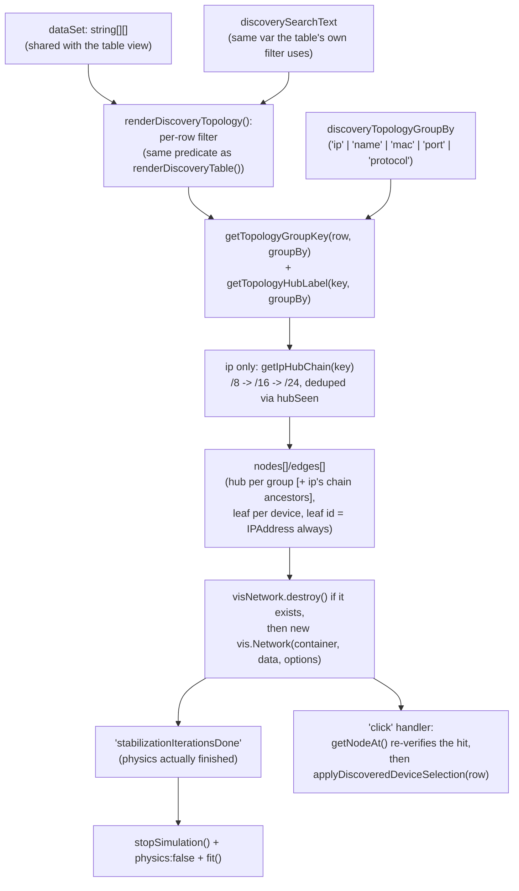

# DESIGN — Discovery Result Star Topology View

| | |
|---|---|
| Title | Discovery Result Star Topology View — Design Document |
| Abstract | `vis.Network` feasibility, the client-side grouping data model, and the 4-iteration interaction-stability fix (hover/click/drag across re-renders). |
| Status | Implemented |
| Author | Youngho Kim |
| Milestone | Unreleased (post v1.0.2) |
| Related docs | [PRD](PRD.md) · [MRD](MRD.md) · [SRS](SRS.md) · [TC](TC.md) |

## History

| Version | Date | Author | Description |
|---|---|---|---|
| 1.0 | 2026-08-27 | Youngho Kim | Initial DESIGN for the Star Topology view feature. |
| 1.1 | 2026-08-27 | Youngho Kim | Documented disabling `layout.improvedLayout` to stop a repeated console warning. |
| 1.2 | 2026-08-28 | Youngho Kim | Added Title/Abstract/Author/Milestone/History metadata. |
| 1.3 | 2026-09-01 | Youngho Kim | Added "The `ip` grouping's hub hierarchy" section: `/8`→`/16`→`/24` hub-to-hub chain, dedup via `hubSeen`, and the per-`/8`-root color-cycling change. |

## Feasibility finding: `vis.Network` needed zero new dependencies

`package.json`'s `vis` package (the old monolithic vis@4.x bundle) ships `Timeline`, `DataSet`,
*and* `Network` in one module; `window.ts` only ever used the first two (`vis.Timeline` for the
playback timeline, see `updateTimeline()`). Since `window.ts` already does `import * as vis from
'vis'`, Vite already bundles the whole module regardless of which properties are accessed off it —
property access on a wildcard import can't be tree-shaken — so `new vis.Network(...)` was reachable
immediately, confirmed by the built `build/shared/window.js` bundle size being unchanged
before/after adding the topology code. See `MEMORY.md`'s "Discovery result 'Star Topology' view"
entry.

## Data model: one flat list, no real hierarchy

`window.ts`'s `dataSet: string[][]` (`[Name, IPAddress, MACAddress, Port, URL, Protocol]`) is a
flat, IP-keyed list — `addDiscoveredDeviceRow()` is the single write path, shared by both the table
and topology views (see `../architecture.md`'s "Discovery result views" section). SUNAPI discovery
replies carry no parent/child device field (confirmed against `src/sunapi/response.ts`'s
`toLegacyDeviceObject()` — the only NVR-adjacent field, `nMaxChannel`, is a channel *count*, not
per-channel identity, and isn't even forwarded into `dataSet` today). This is why every grouping
this feature offers is a client-side derivation of fields already in that flat list, and why hub
nodes are never linked to each other — there is no real edge to draw between them. The one
exception is the `ip` grouping's own `/8`→`/16`→`/24` hub chain (see the next section) — that
nesting is still computed purely from the flat list (no new data source), but unlike every other
grouping's hub, it *is* a real relationship (IP-subnet containment), not an arbitrary one, so it's
drawn as one.

## The `ip` grouping's hub hierarchy: `/8` → `/16` → `/24`, not one flat hub per subnet

Every other `groupBy` value produces exactly one hub level: one hub node per distinct key, never
linked to another hub. `ip` used to work the same way — one hub per `/24` (`getTopologyGroupKey`'s
existing 3-dot-segment key), unlinked. That's a strictly *weaker* representation of the data than
it could be, though: a `/24` key like `"192.168.214"` already contains its own `/16` (`"192.168"`)
and `/8` (`"192"`) ancestors as literal substrings — nothing needs to be inferred or fetched, the
containment is right there in the string. `getIpHubChain(key)` makes that explicit:

```
getIpHubChain("192.168.214") === ["192", "192.168", "192.168.214"]
```

`renderDiscoveryTopology()` walks this chain once per device (for `groupBy === 'ip'` only; every
other `groupBy` still gets the old 1-element `[groupKey]` "chain") and, for each entry not already
built this render (tracked in a `hubSeen: {[nodeId: string]: boolean}` map, keyed by the same
`'hub:' + key` id scheme every hub already used), pushes one hub node plus one edge from the
previous chain entry's hub to this one. Two devices sharing a `/16` but differing only in `/24`
(`192.168.214.10` and `192.168.99.20`) each walk a chain whose first two entries (`"192"`,
`"192.168"`) are already `hubSeen` by the time the second device is processed — so that shared
`/16` (and its `/8` parent) gets exactly one node and one inbound edge, not one per device, and the
two devices' `/24` hubs both end up as children of the same `/16` hub. A device on an unrelated
`/8` (`10.0.0.5`) walks its own independent `["10", "10.0", "10.0.0"]` chain, sharing nothing with
the `192.*` branch. The existing hub→leaf edge (`'hub:' + groupKey` → the device's IP) is unchanged
— it always still points at the finest, `/24`-level hub, exactly as before this hierarchy existed.

**Hub label formatting** (`getTopologyHubLabel`) is keyed off the chain entry's own dot-segment
count rather than a separate "which level is this" parameter, since that count already fully
determines it: 1 segment → `"{key}.0.0.0/8"`, 2 → `"{key}.0.0/16"`, 3 → `"{key}.0/24"` (this last
case is byte-for-byte what the label already was before the hierarchy existed, so pre-existing
single-`/24`-with-no-siblings graphs render identically to before — the `/8`/`/16` ancestors are
just two more, previously-absent hub nodes above it).

**Color now cycles by `/8` root, not by `/24` key.** Before this change, `TOPOLOGY_GROUP_COLORS`
cycled by full group key, so two devices in different `/24`s always got different colors even if
they shared a `/16`/`/8` — reasonable when `/24` was the only hub level, but confusing once `/16`/
`/8` hubs exist above them (a `/16` hub with two differently-colored `/24` children, one of which
matches the `/16`'s own color and one which doesn't, reads as an unrelated third color rather than
"this `/16` has two child subnets"). `renderDiscoveryTopology()` now computes a separate
`colorKey` — the chain's first (root) entry for `ip`, the plain group key for every other
`groupBy` (unchanged there) — and looks the palette entry up by that instead, so every hub and
leaf in one `/8` branch (however many `/16`s/`/24`s it contains) shares one color family, and only
a different `/8` (or, for non-`ip` groupings, a different group) gets the next palette entry.

## Architecture



`renderDiscoveryTopology()` (`src/shared/window.ts`) is called from four places, all of which
share this same pipeline: `setDiscoveryViewType('topology')` (first entry into the view),
`#discovery_topology_group_by`'s `change` listener, `#datatable_search`'s `input` listener (when
the topology view is active), and `addDiscoveredDeviceRow()` (when the topology view is active).

## Interaction stability: what it took to get hover/click/drag right across re-renders

This section exists because getting there took five iterations, each of which fixed a narrower
symptom before the actual structural cause was found — condensed here from `MEMORY.md`'s fuller,
blow-by-blow account (see that file's "Discovery result 'Star Topology' view" entry for the full
detail, including exact vis.js source line references).

1. **First guess (wrong): hover looked like a slight zoom, "fixed" by disabling vis's default
   `chosen` styling and manually swapping node color via `hoverNode`/`blurNode` calling
   `DataSet.update()`.** Reading `node_modules/vis/dist/vis.js`'s `Node.getFormattingValues()`
   directly afterward showed this diagnosis was wrong — the default hover path only ever swaps
   `values.color`/`values.borderColor` at draw time, never border width, and never touches the
   `DataSet`. The "fix" was actively harmful: every hover/blur now mutated the live `DataSet`,
   which is exactly the kind of change that can perturb the physics engine.
2. **Second finding (the first real one): `visNetwork.fit()` was racing physics.**
   `renderDiscoveryTopology()` used to call `.fit()` synchronously right after `setData()`, but
   `stabilization: {iterations: 150}` runs asynchronously — most visible after a search re-render,
   since every render starts physics over from scratch on a brand-new `vis.DataSet`. The camera
   would lock onto the graph's bounds while barnesHut was still moving nodes underneath it; the
   mismatch surfaced on the next redraw (often a hover or click), reading as "that interaction
   causes the jump" without either interaction being the actual cause. Fixed by moving `.fit()`
   (and disabling physics, `stopSimulation()` + `{enabled: false}`) into the
   `stabilizationIterationsDone` handler, so the camera only ever settles once the layout has too.
   `stabilization.fit: false` stops vis's own built-in auto-fit-on-stabilize from also firing and
   racing this.
3. **Third finding: `params.nodes` alone wasn't reliable for click hit-testing right after a
   re-render.** It's resolved from hit-testing done at click time against wherever nodes were
   positioned *then* — mid-stabilization, several unrelated nodes can still be bunched near their
   shared starting position. Fixed by re-querying `visNetwork.getNodeAt(params.pointer.DOM)`
   inside the click handler — an authoritative, current-position hit-test — instead of trusting
   `params.nodes[0]` as-is. Confirmed this doesn't interfere with dragging (a node, or the canvas
   to pan): those are handled by vis's interaction/manipulation module directly from pointer
   deltas, entirely separate from the `click` event.
4. **The actual root cause, found last: reusing one `vis.Network` instance across renders.** Even
   after (2) and (3), *every* interaction — hover, click, click-and-drag — was still wrong
   specifically after a search re-render, not just the narrower cases each earlier fix targeted.
   That breadth was the signal that (2) and (3) had been patching symptoms of one shared cause:
   `renderDiscoveryTopology()`'s `else` branch reused the existing instance
   (`visNetwork.setOptions(options); visNetwork.setData(data);`), only constructing `new
   vis.Network(...)` the very first time. Something about repeated `setData()` calls on the same
   long-lived instance left stale internal state behind (most likely mouse/canvas coordinate
   handling, physics, or both — this old vis@4.20 build's lack of a changelog or `.d.ts` made it
   impractical to pin down further without a real browser to instrument). **Fixed by calling
   `visNetwork.destroy()` and reconstructing a fresh `new vis.Network(...)` on every render** (FR-10),
   with the `click`/`stabilizationIterationsDone` listeners re-registered each time instead of once.
   Every render now starts from the exact same known-good state the very first render always did.

**Lesson carried into SRS FR-10/FR-13 and NFR-4**: when several seemingly-different interaction
bugs all share one precondition ("only after a re-render"), stop patching them one at a time — look
for what that precondition actually changes structurally before trying a narrower fix.

## `layout.improvedLayout: false`

vis@4.x's `improvedLayout` (on by default) runs a clustering + kamada-kawai initial-positioning
pass, but only once node count exceeds its internal 150-node threshold
(`node_modules/vis/dist/vis.js`'s `_initialDrawing`) — real discovery results routinely exceed
that. When clustering can't reduce below the threshold, it bails and logs "This network could not
be positioned by this version of the improved layout algorithm. Please disable improvedLayout for
better performance." straight to the console, on *every* render (destroy-and-reconstruct means
every search keystroke, group-by change, or newly-discovered device re-triggers it). Disabled via
`layout: { improvedLayout: false }` in `renderDiscoveryTopology()`'s `options` — the physics engine
(`barnesHut`, already relied on for node placement) positions the graph regardless, so this is a
pure noise/wasted-computation fix with no positioning-quality tradeoff for this feature's graphs.

## Components

- **`src/shared/window.html`** — `#discovery_view_type` (Table/Star Topology), 
  `#discovery_topology_group_by_wrap` > `#discovery_topology_group_by` (5 grouping options),
  `#datatable_topology` (the graph container, `vis.Network` mounts its canvas into this div).
- **`src/shared/css/table.css`** — `.datatable-toolbar` laid out as a flex row (search box +
  both selects); `#datatable_topology` given a fixed height matching `.datatable-scroll`'s.
- **`src/shared/window.ts`**:
  - `getTopologyGroupKey()` / `getTopologyHubLabel()` — the per-`groupBy`-type rules from
    SRS FR-4/FR-5, table-driven via `TOPOLOGY_GROUP_COLUMN`.
  - `getIpHubChain()` — `ip`-only: expands a `/24` group key into its `/8`/`/16`/`/24` ancestor
    chain (SRS FR-4/FR-7); see "The `ip` grouping's hub hierarchy" above.
  - `TOPOLOGY_GROUP_COLORS` — a fixed 6-entry hub/leaf color palette, cycling by `colorKey` (the
    chain's root entry for `ip`, the plain group key otherwise — see above), kept as plain hex
    strings deliberately (see the "hover" bullet below).
  - `renderDiscoveryTopology()` — the pipeline in the diagram above: filter → group → build
    nodes/edges → destroy old `vis.Network` if any → construct a new one → wire `click` and
    `stabilizationIterationsDone`.
  - `applyDiscoveredDeviceSelection(row_data)` — extracted from what used to be inline in the
    table's row-click handler, now shared by both the table's `tbody` click listener and the
    topology's `click` listener (FR-11).
  - `setDiscoveryViewType(viewType)` — toggles which container(s)/selector(s) are visible; calls
    `renderDiscoveryTopology()` on first entry into the topology view.

## Why node `color` is a plain hex string, not a manually-managed hover state

Plain hex strings are deliberate, not an oversight: `vis.Network`'s own color normalization
(`node_modules/vis/dist/vis.js`'s `exports.parseColor()`) already expands a hex string into
`background`/`border` plus HSV-lightened/darkened `highlight`/`hover` variants automatically, and
applies the hover variant purely at draw time (`Node.getFormattingValues()`) — no `DataSet`
mutation involved, so hovering can't perturb physics (see "Interaction stability" step 1 above for
the more complicated, DataSet-mutating approach this replaced and why it was actively worse).

## Security considerations

None beyond what already applies to the table view — this feature adds no new data source, no new
network request, no new permission, and no new externally-reachable message handler. It renders
exactly the same `dataSet` the table already displays, using a library already bundled into the
same page.

## Alternatives rejected

- **Reusing the `vis.Network` instance across renders** (`setOptions()`+`setData()` instead of
  destroy-and-reconstruct). Tried first as the more "efficient" approach (avoids rebuilding the
  canvas/DOM on every keystroke in the search box); rejected once it was found to be the actual
  cause of every post-re-render interaction bug — see "Interaction stability" step 4 above.
- **Manual per-node hover-color state via `hoverNode`/`blurNode` + `DataSet.update()`**. Tried
  first, reverted — see "Interaction stability" step 1 and "Why node `color` is a plain hex
  string" above. vis's own built-in hover derivation does the same job with zero risk of
  perturbing physics.
- **A fixed IP-`/24`-only grouping** (no `Group by` selector). This was the first shipped cut of
  the feature; generalized almost immediately once real usage showed other groupings (Name, MAC,
  Port, Protocol) answer equally common questions — see [MRD.md](MRD.md).
- **Real NVR→channel topology** instead of client-side derived grouping. Rejected for this
  iteration as materially larger scope (needs new per-NVR SUNAPI channel enumeration wired into
  the discovery pipeline, not just the display layer) — see [MRD.md](MRD.md) and
  [PRD.md](PRD.md)'s Non-Goals.
