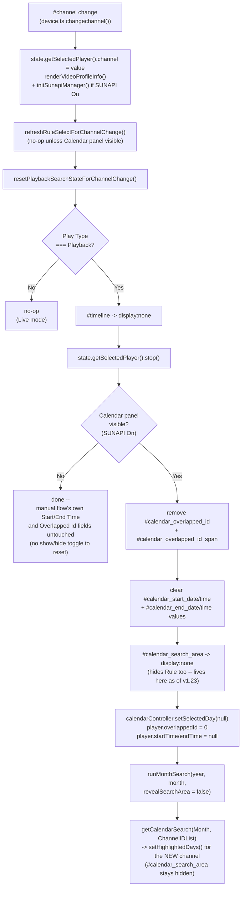

# DESIGN — Window UI Full Specification & Reimplementation

| | |
|---|---|
| Title | Window UI Full Specification & Reimplementation — Design Document |
| Abstract | `src/shared-v2/` module structure, the mock-SUNAPI server, and deviations from legacy behavior. |
| Status | Draft |
| Author | Youngho Kim |
| Milestone | Unreleased (post v1.0.2) |
| Related docs | [PRD](PRD.md) · [MRD](MRD.md) · [SRS](SRS.md) · [TC](TC.md) |

## History

| Version | Date | Author | Description |
|---|---|---|---|
| 1.0 | 2026-08-28 | Youngho Kim | Initial DESIGN. |
| 1.1 | 2026-08-28 | Youngho Kim | "Deviations from legacy behavior": confirmed live via Playwright (TC-26) that the `element.device` stray-global bug is a real, always-reproducible crash (NVR + SUNAPI-on fails on the original every time), not a dormant/theoretical one as first written. |
| 1.2 | 2026-08-28 | Youngho Kim | Added a third deviation: `updateTimeline()` now `fit()`s the visible window to the actual item range instead of the original's hardcoded "today" window, which left real (non-today) recordings invisible — reported directly by the user against a real device, not found via equivalence testing. |
| 1.3 | 2026-08-28 | Youngho Kim | `getTimeline` endpoint table row corrected to the real `{TimeLineSearchResults: [...]}` envelope — the mock server's fixture (and `src/shared-v2/playback.ts`'s own unwrapping) had matched each other on a wrong, unwrapped shape, which real-device testing (not equivalence testing) caught. This is a genuine `src/shared-v2/` bug fix, not a new deviation entry — see SRS.md FR-7.3. |
| 1.4 | 2026-08-28 | Youngho Kim | Retracted v1.2's "hardcoded to today" deviation entirely — a misdiagnosis. `vis.Timeline` already auto-fits to real item data on `setItems()`; the `fit()`/`setWindow()` call added to "fix" it broke rendering entirely at real (~150-item) data volume once tested live, rather than fixing anything. Removed the call; the true root cause of the user's original report was v1.3's envelope-unwrapping bug. |
| 1.5 | 2026-08-28 | Youngho Kim | Added a fourth deviation: `sunapiInitInFlight` + a same-value check on username/password `change` handlers, eliminating redundant `initSunapiManager()` chains. Found via CPU profiling + live network-request counting after the user's follow-up performance report — vis.Timeline's own rendering was already confirmed fast; the real cost was redundant SUNAPI round trips. |
| 1.6 | 2026-08-28 | Youngho Kim | Added FR-7.8 (SUNAPI-driven Calendar search, `src/shared-v2/`-only) — module structure, mock-server endpoint rows, and the design reasoning behind the two-panel switch, the merge-both-responses Rule dropdown, and the static Language option list. |
| 1.7 | 2026-08-28 | Youngho Kim | Documented that FR-7.1-FR-7.7's manual flow is genuinely unreachable (not just hidden alongside an alternate path) whenever SUNAPI is On and Playback is selected — a real conflict with the pre-existing equivalence-test suite, found only by running it, fixed on the test side (`docs/window-ui/TC.md` v1.6) rather than the feature's own design. |
| 1.8 | 2026-08-28 | Youngho Kim | "Build wiring" above updated: `buildSharedV2()` now overwrites `dist/chrome-extension/`/`dist/nodejs/examples/public/`'s shared web assets after `npm run build`, reversing MRD.md's original "parallel, not in-place" call per explicit user instruction — see MRD.md's History. |
| 1.9 | 2026-08-28 | Youngho Kim | Rewrote "Why the Rule dropdown merges..." — retracted the `getDynamicRulesOptions()`/`getDynamicRules()` merge-by-`Type` design; a real device's Timeline endpoint only accepts `Type=Rule<N>`, reported directly by the user with the real `eventrules.cgi?msubmenu=dynamicrules` response. Rule dropdown is now `getDynamicRules()`'s `Rules` filtered by channel — see SRS.md FR-7.8.2 v1.8. |
| 1.10 | 2026-08-28 | Youngho Kim | Corrected the `Rule<N>` numbering to 1-based (`Rule: 0` → `Type=Rule1`) — reported by the user immediately after v1.9. See SRS.md FR-7.8.2 v1.9. |
| 1.11 | 2026-08-28 | Youngho Kim | Added the `"All"` default option (`Type=All`), matching `getTimeline()`'s own default — reported by the user with the exact expected query. See SRS.md FR-7.8.2 v1.10. |
| 1.12 | 2026-08-28 | Youngho Kim | Added "Why runMonthSearch()'s first call waits on a barrier" — a real, confirmed race in the vendored `@melchi45/rtsp-over-websocket` library's shared digest-auth retry counter, reported by the user as an intermittent 401. See SRS.md FR-7.8.4 v1.11 and MEMORY.md. |
| 1.13 | 2026-08-28 | Youngho Kim | Added "A second occurrence, same root cause" — the same race hit `getOverlappedIdList()`/`getTimeline()` on every day click, not just the panel's first show; sequenced them too, and revised the "safe once cached" claim above (contradicted by this recurring on later calls). See SRS.md FR-7.8.5 v1.12. |
| 1.14 | 2026-08-28 | Youngho Kim | `#playback_calendar`'s stray `class="field"` (forced horizontal layout instead of stacked) fixed — one-line removal, reported by the user with a screenshot. |
| 1.15 | 2026-08-28 | Youngho Kim | Rewrote `updateTimeline()`'s deviations entry: single auto-stacked "All" group + dynamic per-Type coloring, replacing the fixed Normal/Event/detection-type-enum layout — requested by the user. Also documented a separate, still-open `vis.Timeline` item-positioning bug found while verifying it, confirmed pre-existing and unrelated to this change. See SRS.md FR-7.6 v1.14 and MEMORY.md. |
| 1.16 | 2026-08-31 | Youngho Kim | Added a new deviation entry: v1.14's auto-stacked `"All"` group replaced with `stack: false` (one literal line) + one added row per distinct Rule#, `height: 'auto'` replacing a fixed `maxHeight`, and Rule#-keyed color assignment — requested by the user right after v1.14 shipped, since auto-stacking still grew tall on genuine overlap and gave no way to tell Rules apart. See SRS.md FR-7.6 v1.15. |
| 1.17 | 2026-08-31 | Youngho Kim | Added a new deviation entry: `vis.Timeline` replaced entirely by a new custom widget, `src/component/event-timeline/` (own doc set, `docs/event-timeline-component/`) — requested by the user via a reference screenshot of a different app's dark "ONVIF Timeline" view; confirmed a reskin couldn't reach it (`vis.Timeline` has no native overview/minimap concept). Clarified the v1.14/v1.15 still-open positioning-bug note as no longer reachable from `src/shared-v2/` (still open in `src/shared/`'s untouched original). See SRS.md FR-7.6 v1.16. |
| 1.18 | 2026-08-31 | Youngho Kim | Added a new deviation entry: Timeline item selection now sets and enables both Manual Start/End Time for every item, `"Normal"`-classed items included — the legacy `"Normal"` = start-only/disabled-End-Time special case (undocumented, no rationale found) is not reproduced, since `recording.cgi` always returns a real `EndTime` for every result row regardless of `Type`. Requested directly by the user. See SRS.md FR-7.6 v1.18. |
| 1.19 | 2026-08-31 | Youngho Kim | `resolveEventLabel()`'s Rule→RuleName lookup now also requires a matching `EventSources[].Channel` (the currently selected player's 0-based channel, same value as the search's own `ChannelIDList`) — `getDynamicRules()` is device-wide, and `Rule` numbers aren't guaranteed unique across channels. Reported directly by the user. See SRS.md FR-7.6 v1.19. |
| 1.20 | 2026-08-31 | Youngho Kim | Added a new note: `updatePlaybackSunapiUIVisibility()` now also hides `#timeline` on switching Play Type to Live — the sibling-placement change (above, this section) fixed cross-Playback-panel hiding but left nothing responsible for hiding `#timeline` on leaving Playback mode entirely. Reported directly by the user. Also corrected this doc's own file attribution for the function (`playbackCalendar.ts`, confirmed already correct here; SRS.md had the stale `playback.ts` reference, now fixed there too). See SRS.md FR-7.8 v1.20. |
| 1.21 | 2026-08-31 | Youngho Kim | Added a new note: `getCalendarSearch()`'s highlighted-recorded-days data had no channel-change refresh at all (unlike the Rule dropdown's own `refreshRuleSelectForChannelChange()`), so switching `#channel` left the Calendar showing the previous channel's recordings. Fixed with a new `refreshCalendarSearchForChannelChange()`, same guard/scope as the Rule dropdown's version. Reported directly by the user. See SRS.md FR-7.8.4 v1.21. |
| 1.22 | 2026-08-31 | Youngho Kim | Added a new note + flow diagram: channel change during Playback is now a complete 5-part reset (Calendar refresh, `#timeline` hide, Overlapped Id reset+hide, Manual Start/End Time reset+hide, player stop), reported directly by the user as one scenario. Explains the scoping split (shared `#timeline`/player run regardless of SUNAPI state; Overlapped Id/Manual Start-End Time resets are Calendar-panel-only, since the manual flow's equivalents have no show/hide toggle) and the `runMonthSearch()` `revealSearchArea` parameter added to avoid the re-fetch undoing its own hide. See SRS.md FR-7.8.6 v1.22. |
| 1.23 | 2026-08-31 | Youngho Kim | Added a new note: `#event_rules_type` (Rule) moved into `#calendar_search_area`, positioned before Overlapped Id — it's a Timeline search filter like the fields after it, not a device-wide setting like Language, so it now shows/hides on that container's timing instead of appearing immediately on panel open. Reported directly by the user. Also documents the day-click fix this move surfaced: `onCalendarDayClick()` now unconditionally re-shows `#calendar_search_area` first, since a day stays clickable independent of that container's hidden state left by FR-7.8.6's channel-change reset. See SRS.md FR-7.8.2/FR-7.8.5 v1.23. |
| 1.24 | 2026-08-31 | Youngho Kim | Added a new note: `#event_rules_type` now has its own `change` listener, immediately re-fetching `getTimeline()`/redrawing `#timeline` with the newly-selected Rule instead of waiting for the next day click. `buildCalendarSearchTimeRange()`/`runCalendarTimelineSearch()` factored out of `runOverlappedAndTimelineSearch()` so this doesn't also re-fetch Overlapped Id, which doesn't depend on `Type`. Reported directly by the user. See SRS.md FR-7.8.2 v1.24. |
| 2.0 | 2026-08-31 | Youngho Kim | Added a new section, "v2.0 Playback search redesign" — FR-7.1-7.3's manual search UI (`#search_overlapped_id`/`#search_date`/etc.) and FR-7.4's Manual Start/End Time are retired; search now runs off the Event Timeline's own preset buttons (default "1 day ending now", `[now-preset, now]` on click, real re-fetch not local re-zoom) for both Playback UIs, and "Selected Time" (the renamed Manual Start/End Time) moved into that widget, fixing a latent bug where `onSelect` always wrote to the manual flow's fields even while the Calendar flow was active. Reported directly by the user, with a significant scope-clarifying follow-up mid-implementation. See SRS.md v2.0/`docs/event-timeline-component/` v2.0/`MEMORY.md`. |
| 1.25 | 2026-08-31 | Youngho Kim | `updateTimeline()` now filters `Results[]` by `eventAppliesToChannel()` before building rows/items — a real device's Timeline response included a different channel's Rule events mixed into the queried channel's results, reported directly by the user with a screenshot. See SRS.md FR-7.6 v1.25. |
| 1.26 | 2026-09-01 | Youngho Kim | `eventAppliesToChannel()` fixed to check every `state.dynamicRuleEntries` entry sharing a Rule number instead of just the first `.find()` match — the same Rule number can be configured separately per channel, so matching on Rule number alone could land on a different channel's entry and wrongly drop a legitimate same-channel event, making the rendered timeline sparser than the camera's actual data. Reported directly by the user comparing a real device's raw Timeline response against the rendered result. See SRS.md FR-7.6 v2.12. |
| 1.27 | 2026-09-01 | Youngho Kim | Added FR-3.4 (SRS.md v2.13): `#password` show/hide eye-icon toggle, new-page-only. Documented as a Deviation below since `src/shared/`'s own `#password` is untouched. The two SVG icons/`.password-field`/`.password-toggle` CSS live in `src/shared/css/window.css` (the single physical source `css/window.css` reuses for both pages, per this doc's CSS-reuse note) — unused-but-harmless for `src/shared/`'s own page, which has no `.password-field` wrapper in its markup. Requested directly by the user. |
| 1.28 | 2026-09-01 | Youngho Kim | Added a new section, "Overlapped Id moves into the Event Timeline widget" (SRS.md v2.14) — Overlapped Id moves out of `#overlapped_id_area`/`#calendar_overlapped_id_area` into the shared widget's own toolbar (`docs/event-timeline-component/SRS.md` FR-15 v2.11), the same single-canonical-control move v2.0 already did for Selected Time; corrects the earlier FR-7.8.6 "not shared" analysis, which predates that move. Requested directly by the user. |
| 1.29 | 2026-09-01 | Youngho Kim | Catch-up entry: `#event_rules_type` (Rule) moves out of `#calendar_search_area` (retired) into the shared Event Timeline widget's own toolbar, immediately left of Overlapped Id (`docs/event-timeline-component/SRS.md` FR-16 v2.12, SRS.md v2.15) — same move as v1.28 did for Overlapped Id. Updates the v1.23/v1.24 notes below, which described the now-retired `#calendar_search_area` placement. `#playback_control_calendar`/`#timeline` also laid out side by side (`.playback-calendar-timeline-row`) instead of stacked, with a `#playback_calendar` flex-shrink width bug fixed alongside it. Requested directly by the user. |
| 1.30 | 2026-09-01 | Youngho Kim | `#event_rules_language` moves out of `#playback_control_calendar` into the Device panel's `#time_info` row, immediately left of `#is_android` (SRS.md v2.16) — always visible regardless of Play Type, fetched as soon as SUNAPI turns On instead of waiting for this Calendar panel to first show. Requested directly by the user. |
| 1.31 | 2026-09-01 | Youngho Kim | "Build wiring" updated: `src/shared-v2/vite.config.ts` now sets `sourcemap: true` and a new `npm run build:shared-v2:dev` (`--mode development`) skips minification, so the browser debugger can step through `src/shared-v2/modules/*.ts` directly (e.g. `playback.ts`'s `ontimestamp()`) instead of the bundled `window.js` — requested directly by the user, who needed to debug `ontimestamp` in the browser console after the TS→JS build. New `window-ui` skill (mirroring `shared-window`) added to formalize this doc set's before/after checklist. See `MEMORY.md`. |
| 1.32 | 2026-09-01 | Youngho Kim | The `.playback-calendar-timeline-row` wrapper (v1.29) gained an explicit `id="playback-calendar-timeline"` alongside its existing class -- an addressability change (a stable hook for JS/tests), styling stays keyed on the class. Requested directly by the user. |
| 1.33 | 2026-09-01 | Youngho Kim | `#playback-calendar-timeline` (v1.32) now toggles `display: flex`/`none` explicitly in `updatePlaybackSunapiUIVisibility()` on `isPlayback` alone -- same explicit-toggle pattern already used for `#playback_video_controls` right above it, requested directly by the user asking whether this wrapper followed the same Live/Playback show-hide pattern already used elsewhere. Replaces the previous, narrower `if (!isPlayback) { #timeline.style.display = 'none' }` special case: that only ever hid `#timeline` itself (added because a leftover Playback-search timeline stayed visible after switching to Live), leaving the group wrapper's own visibility merely *implicit* (empty, but not actually `display:none`, since `#playback_control_calendar` and `#timeline` were hidden separately rather than their shared container). `#timeline`'s own `style.display = 'block'` sets (a real search completing) are unaffected -- irrelevant while an ancestor is `display:none`, and still what decides whether to show the widget at all once back in Playback mode. |
| 1.34 | 2026-09-01 | Youngho Kim | `#video_source_group` ("Video Source (selected channel)" -- profile/resolution/fps selection) now also toggles `display: block`/`none` on `isPlayback` in `updatePlaybackSunapiUIVisibility()`, hidden during Playback (an already-recorded segment plays back whatever profile it was recorded in, so profile selection doesn't apply) and shown for Live. The user's v1.33 question named this section as the pattern `#playback-calendar-timeline` should follow, on the assumption it already toggled this way -- it turned out not to (nothing gated it on Play Type before this entry, confirmed live via screenshot: it stayed visible in Playback mode), so this entry adds that behavior for real rather than just matching a precedent. |
| 1.35 | 2026-09-01 | Youngho Kim | Added a new note (SRS.md FR-7.7 v2.18): `playback.ts`'s `updateTimestampReadout()` now also moves the Event Timeline's current-time marker itself, from the exact same `dateStr`/`timeStr` it writes into `#timestamp_date`/`#timestamp_time` -- previously `ontimestamp()`'s own `'playback'` case computed the marker's Date separately (a parallel GMT-aware `moment` calculation), which could drift from what the readout displayed at the same instant. Reported directly by the user with a screenshot: the marker sat far to the right of the actual playback position the readout was correctly showing. New `moveTimelineMarker` parameter (default `true`) preserves the pre-existing "only move while actually PLAYING, else clear" guard for the `'playback'` case specifically. Whether the reconstruction appends a trailing `'Z'` depends on `#universaltime_checkbox` (checked -> true UTC, unchecked -> local-styled digits matching how the timeline's own items parse SUNAPI's timezone-less wire format) -- an initial version always appended `'Z'` regardless, which the user caught live and had corrected to check this checkbox explicitly. Also logs the resolved marker Date to the console on every move, per the user's own request, so it can be checked directly against the checkbox's state. See `MEMORY.md`. |
| 1.36 | 2026-09-01 | Youngho Kim | Added a new deviation: `#iso_date_time_checkbox` wired to `player.useIsoTimeFormat` (SRS.md FR-7.7.1 v2.19), fixing a real camera playback seek bug and moving it out of § Known dead controls. Root-caused via a live console trace the user asked to have added in `@melchi45/rtsp-over-websocket`'s `RTSPOverWebSocket.ts:seeking()`: the Event Timeline's drag-seek (FR-14) always landed the camera's playback on the same wrong position no matter where the marker was dropped -- two separate drags to different targets (16:06:22, then 16:37:27) both reported the exact same actual playback position back (15:43:19.434). The trace showed why: for camera devices, `seeking()`'s non-ISO branch is a no-op (legacy dead code, preserved verbatim) unless `player.useIsoTimeFormat` is truthy, and nothing in this app ever set that property -- so the outgoing `rangeClock` never reflected the just-requested seek target, just whatever stale value happened to already be there (confirmed live: `useIso: null` in the trace while `rangeClock` held an unrelated leftover value). See `MEMORY.md`. |
| 1.37 | 2026-09-01 | Youngho Kim | The real fix for the camera seek bug turned out to live entirely in `@melchi45/rtsp-over-websocket` itself (three real bugs there -- `seeking()`'s stale `rangeClock`, `generateRTSPURL()`'s GMT double-add, and a camera-vs-NVR clock-format mismatch -- see that package's own `MEMORY.md`), not in `#iso_date_time_checkbox`'s wiring from v1.36, which stays correct but is no longer load-bearing for the fix. SRS.md FR-7.7 v2.20: removed the `[FR-14] event_timeline_custom_time_hit -> ...` console log (added v1.35/SRS.md v2.18) now that it's served its diagnostic purpose and was firing many times a second during ordinary playback. Removed directly at the user's request. |
| 1.38 | 2026-09-01 | Youngho Kim | SRS.md FR-6.9 v1.27: Stop-during-Playback regression -- `videoControl.ts`'s `onstatechange()` STOPPED branch now gates `player.startTime = null`/`endTime = null` on `playType === PLAYBACK` and wraps both in `try`/`catch`, the same defensive pattern this branch's own `#timestamp_date`/`#timestamp_time` `.remove()` calls already use (documented just above in SRS.md) for the identical failure class: a throw here aborts every button-state reset below it. Root cause was again in `@melchi45/rtsp-over-websocket`, not this repo -- `startTime`'s setter never accepted `null` (asymmetric with `endTime`'s, which always did), and since the throw happened synchronously inside a `dispatchEvent` chain called from deep within the RTSP client's own connection callback, it unwound back up and killed that callback before it ever reached the step that actually tears down the `<video>`/MSE state -- Stop sent a real TEARDOWN and got a real response, but the browser kept looping the last ~2s of buffered video forever. Root-caused via a live console trace the user asked to have added across the whole RTSP-close call chain (`Disconnect()` -> `RtspResponseHandler` -> `clearTransport()` -> `connectionCbFunc()` -> `StreamPlayer.close()` -> `VideoTagPlayer.close()`), which pinpointed the exact throw and its stack. See MEMORY.md. |
| 1.39 | 2026-09-01 | Youngho Kim | SRS.md FR-6.9 v1.28: resume-from-stop-point -- Stop's `startTime` reset now reads `#timestamp_date`/`#timestamp_time`'s current value (captured before those elements are removed just above) instead of unconditionally writing `null`, so a later plain Play resumes from the actual last-played position rather than requiring a fresh Selected Time/timeline pick. `endTime` is unaffected (stays always-`null` -- resuming plays forward, not bound to the original search range). The user first proposed sourcing this from the Event Timeline's Selected Time end fields (`#selected_end_date`/`#selected_end_time`), then self-corrected to the timestamp readout once the distinction was raised (those track the *originally selected range's* end, not the actual position playback was stopped at -- easy to conflate since both are "end"-ish fields, but only the timestamp readout is continuously updated as playback progresses). |
| 1.40 | 2026-09-01 | Youngho Kim | SRS.md FR-7.5 v2.23: `#speed` syncs from the device, not just to it -- new `changespeed` player event (`onchangespeed()`, `playback.ts`) updates the dropdown when `@melchi45/rtsp-over-websocket` self-corrects `playSpeed` from a device-reported RTSP `Scale` that differs from what was requested (a device can clamp/reject an unsupported speed and echo back the one it actually applied). Root cause and fix are entirely upstream in that package (`Scale` response-header parsing it never did before, a `resolvePlaySpeedEntry()` helper extracted from the existing `playSpeed` setter so the self-correction path can update state without re-sending the request); this repo only adds the listener side. Reported directly by the user with a real RTSP transcript (`Scale: 0.75` requested, `Scale: 1` in the `200 OK`). See MEMORY.md. |
| 1.41 | 2026-09-01 | Youngho Kim | SRS.md FR-7.6 v2.24: double-clicking an event directly (not empty track space) during active playback now seeks onto that event's own real start instead of an approximate pixel position, and Selected Time/`player.startTime`/`endTime` update to match it too. Two independent bugs combined to produce the reported symptom (a double-click landing seconds-to-minutes away from the actual event, with Selected Time still showing the previous range): the event-timeline component's own pixel-ratio math (`docs/event-timeline-component/DESIGN.md` v2.10) and `playback.ts`'s `onSelect` silently no-op'ing while `PLAYING` with nothing double-click-specific to compensate. Fixed by extracting `onSelect`'s body into `applyItemToSelectedTime()`, now also called from `onDoubleClick` whenever the widget hands back the double-clicked item itself (`docs/event-timeline-component/SRS.md` FR-8 v2.14's new second argument). Reported directly by the user with a console trace showing the mismatch. |
| 1.42 | 2026-09-01 | Youngho Kim | Added a new deviation: `#forward`/`#backward` wired to `player.forward()`/`.backward()` (SRS.md FR-6.11 v2.25), moving them out of § Known dead controls. Reported directly by the user; unlike prior fixes in this history, root cause wasn't a bug in `@melchi45/rtsp-over-websocket` — its frame-level stepping (`forward()`/`backward()`, canvas-renderer `StepBufferList`) was already fully implemented, just never called from either window UI's buttons. Confirmed, on the user's clarification, that no further plumbing was needed for "works independent of Pause" or "Play resumes from the stepped-to position" — both already fall out of the library's own `playType`-only gating and the existing FR-7.7/FR-6.9 v1.28 `timestamp`-event pipeline. |
| 1.43 | 2026-09-02 | Youngho Kim | SRS.md FR-4.5/FR-7.8.1 v2.16 (again): a third occurrence of the same digest-auth race documented at v1.11/v1.12 below, this time between `initSunapiManager()`'s own `attributes.cgi` request and `fetchDeviceLanguage()`'s `getDeviceInfo()` — introduced by v2.16 itself, which moved `fetchDeviceLanguage()` to fire "as soon as SUNAPI turns On" without noticing that `device.ts`'s `on_change_use_sunapi_client()` already fires `initSunapiManager()` (whose `init()` sends `attributes.cgi`) immediately before it, so the two ended up genuinely concurrent rather than sequenced. Reported directly by the user against a real device as both `attributes.cgi` and `system.cgi?msubmenu=deviceinfo` coming back `401` together. Fixed by moving the `fetchDeviceLanguage()` call from `on_change_use_sunapi_client()` into `initSunapiManager()`'s own `attributes.cgi` success handler (`device.ts`), so it only fires once that request has actually settled — same sequencing principle as `firstShowBarrier`/the `getOverlappedIdList()` → `getTimeline()` ordering below, applied one step earlier in the chain. |
| 1.44 | 2026-09-02 | Youngho Kim | SRS.md FR-7.5 v2.27: `#speed`'s `<option value="1">1x</option>` now carries `selected` — with no `<option>` marked `selected`, the native `<select>` defaulted to whichever came first in DOM order (`0.25x`), disagreeing with `RTSPOverWebSocket.ts`'s own internal `_playSpeed` default (`speed_1x`, value `1`). v2.23's self-correction dispatch only fires on a mismatch between the device's echoed `Scale` and `_playSpeed` — on a fresh page load or a brand-new playback open, the device's `Scale: 1` response matched `_playSpeed`'s already-`1` default exactly, so no mismatch was ever detected and `#speed` stayed on `0.25x` indefinitely despite `1x` actually playing. Reported directly by the user with a real RTSP transcript (`Scale: 1.000000` requested and echoed back), after tracing the entire v2.23 callback chain (`RtspClient.ts` Scale parsing → `errorCallbackFunc` → `onRTSPOverWebSocketError`'s mismatch check) end-to-end and confirming it was working correctly — isolating the bug to this HTML default instead. `src/shared/window.html`'s equivalent markup has the identical missing-`selected` issue; left as-is since that tree is untouched by this reimplementation. See MEMORY.md. |
| 1.45 | 2026-09-02 | Youngho Kim | SRS.md FR-7.8.6 v2.28: `resetPlaybackSearchStateForChannelChange()`'s `state.getSelectedPlayer().stop()` call individually `try`/`catch`-guarded — it throws `RTSPOverWebSocketError` 0x1000 ("player object is not exist") whenever Play was never clicked yet for the current device (the element's internal player instance is only created lazily inside `play()`), a throw this function's own outer `try`/`catch` previously caught, silently skipping every step after it — including the Calendar's `getCalendarSearch()` re-fetch for the new channel. Same general failure class as several `@melchi45/rtsp-over-websocket`-side fixes this session (an unguarded call that can throw, positioned mid-function, silently aborting everything after it), just on this repo's own calling code instead. Reported directly by the user: `recording.cgi`'s `msubmenu=calendarsearch` request never fired after a channel change. See MEMORY.md. |
| 1.46 | 2026-09-02 | Youngho Kim | SRS.md FR-7.7.1 retired (v2.29): `#iso_date_time_checkbox`/`onchangeisodatetime()`/`player.useIsoTimeFormat` removed. A review of every `_useIso`-gated branch in `@melchi45/rtsp-over-websocket` (requested by the user, prompted by "isn't `_useIso` unnecessary?") found its `true` state was a dead TODO stub for camera devices in `generateRTSPURL()` (produced a URL with no start/end embedded) and had no principled reason to be configurable for nvr (only affected millisecond-fraction inclusion). That package now always behaves the way `useIsoTimeFormat: true` used to. See `@melchi45/rtsp-over-websocket`'s own `MEMORY.md` and `docs/player/01-elements-interface-exceptions.md` for the underlying change. |
| 1.47 | 2026-09-02 | Youngho Kim | SRS.md FR-4.6.1 retired (v2.30): `#universaltime_checkbox`/`set_use_universal_time()`/`player.coordinatedUniversalTime` removed, a direct user follow-up to v1.46's `_useIso` removal above. `@melchi45/rtsp-over-websocket`'s `startTime`/`endTime`/`seekingTime` now normalize any input to true UTC unconditionally at the setter, eliminating the "is this already UTC?" ambiguity the checkbox existed to let the user manually resolve. `playback.ts`'s device-branching writes (`applyItemToSelectedTime()`, `onDoubleClick`, `onCustomTimeSeek`) collapse to always `.toISOString()`; `onSelectedTimeChange` now writes a naive (no `'Z'`) string so the player's setter GMT-converts it instead of wrongly trusting it as literal UTC; Selected Time's UI display fields are computed independently from `item.start`/`item.end` (`moment(...).utcOffset(state.localGmtOffset)`) instead of being read back from the player, which would now show UTC digits instead of local ones. `updateTimestampReadout()` (v1.35/v1.36's FR-7.7 note) takes an explicit `isUtcDigits` parameter per caller instead of reading the removed checkbox — a real correctness fix on its own, not just a mechanical swap: a single global checkbox could never correctly describe `ontimestamp()`'s two branches (`timestamp.detail.local` vs. `timestamp.detail.timestamp`), which pass local and true-UTC digits respectively depending on which the player happened to report. See `@melchi45/rtsp-over-websocket`'s own `MEMORY.md` and `docs/player/01-elements-interface-exceptions.md`'s new "Time normalization" section for the underlying change. |
| 1.48 | 2026-09-02 | Youngho Kim | SRS.md FR-6.11/FR-6.10 v2.31: fixed `#forward`/`#backward` crashing (`Cannot read properties of null (reading 'forward')`, caught by `videoControl.ts`'s own `try`/`catch`) when a step click landed while `@melchi45/rtsp-over-websocket`'s internal `MediaRouter.player` was momentarily `null` from an unrelated RTP-packet-loss teardown. Root cause and fix both landed in that package (a `player !== null` guard replacing a non-null assertion in `MediaRouter.sendCommandData()`, plus a new `playerClosed` field on its `0x0107` error/`'waiting'` event — see its own `MEMORY.md`); this repo's `videoControl.ts`'s `onWaiting()` (previously debug-log-only, FR-6.10) now also disables `#forward`/`#backward` when it sees `playerClosed === true` for the video track, so the UI doesn't leave them clickable into a window where the library-side guard would just silently no-op. Reported directly by the user with a live console trace, which also surfaced an unrelated, already-expected Pause/Resume button-state flip (the camera's own Play/Pause ACKs for the step's forward-then-auto-pause pair) traced to a separate cause. See MEMORY.md. |
| 1.49 | 2026-09-02 | Youngho Kim | SRS.md FR-6.11/FR-6.10 v2.32, direct follow-up to v1.48: `forward()`/`backward()` (`videoControl.ts`) now disable both `#forward`/`#backward` right after a successful call, re-enabled only by the next `'statechange'` STEP (step completed) or PLAYING (covers v1.48's stalled-step path) event. A fresh console trace after v1.48 shipped showed the null-crash was gone but a new pattern: dozens of overlapping `forward()` calls per second (a focused button's held-key auto-repeat, or rapid re-clicking), which `MediaRouter.ts`'s single shared step state machine doesn't queue — an overlapping click can stomp which direction an in-flight step resolves as. Reported directly by the user with that trace; user chose the debounce fix over treating the flood as intentional test input. See MEMORY.md. |
| 1.50 | 2026-09-02 | Youngho Kim | SRS.md FR-6.11/FR-6.10 v2.33, direct follow-up to v1.49: fixed a second null-player crash the debounce didn't close — a step's own auto-pause ack could re-enable `#forward`/`#backward` while a separate, still-in-flight buffer-refill re-seek (from an earlier step) had `MediaRouter.player` still `null`; no `'statechange'`-only gate can close a race between two independently-timed async events. `@melchi45/rtsp-over-websocket` now exposes a `'playerstatechange'` event sourced directly from `MediaRouter.ts`'s `player` setter, and `videoControl.ts` routes every step-button-enabling case through a new shared `updateStepButtonsEnabled()` gated on it. Also removed `onWaiting()`'s v2.31 `playerClosed`-specific disable as redundant (same underlying setter call now covered generically) and, as a side effect, made all three enabling cases correctly *disable* (not just leave alone) the step buttons for any non-PLAYBACK `playType`. Reported directly by the user with a fresh live console trace (a `backward()` crash) after v1.49 shipped, who also directly asked whether the null-player window could be eliminated entirely — answered as: not eliminable at the object level, but made fully race-free at the UI level. See MEMORY.md. |
| 1.51 | 2026-09-02 | Youngho Kim | SRS.md FR-6.11/FR-6.10/FR-7.7 v2.34, direct follow-up to v1.50: fixed `#forward`/`#backward` occasionally staying stuck `disabled` even after video had visibly resumed — an ordering hiccup between the `'playerstatechange'`/`'statechange'` events driving v1.50's `playerAvailable` flag could leave it `false` past the point the player was actually usable again. `ontimestamp()` (`playback.ts`) now calls a new `onPlayerFrameRendered(playType)` (`videoControl.ts`) on every rendered `'playback'`-mode frame, forcing `playerAvailable` back to `true` — a frame being rendered at all is direct proof a live player exists, so this is a safe self-correcting fallback on top of v1.50's event-driven mechanism, not a replacement for it. Reported directly by the user: "video is showing but the buttons never re-enabled." See MEMORY.md. |
| 1.52 | 2026-09-02 | Youngho Kim | SRS.md FR-7.6/FR-7.8.2 v2.35: reverted v1.19/v1.25/v2.12's channel filtering of Timeline results/Rule dropdown entries. `resolveEventLabel()` (`playback.ts`) now matches a `"Rule<N>"` Type to its `RuleName` purely by Rule number, `eventAppliesToChannel()` is deleted outright (no more `Results[]` filtering before rows/items are built), and `populateRuleSelect()` (`playbackCalendar.ts`) lists every configured Rule regardless of channel. Reported directly by the user with a real device's `eventrules.cgi?msubmenu=dynamicrules` response (9 Rules split across CH1/CH2) and a live screenshot: Channel 2's `Rule5`/`Rule6`/`Rule8`/`Rule9` (TD/Diff/MD) appearing while Channel 1 was queried is real Timeline data for a dual-sensor camera whose channels share one physical recording timeline, not the cross-channel leak the original v1.25 fix assumed it was. `refreshRuleSelectForChannelChange()` still re-fetches on channel change (kept for parity with `resetPlaybackSearchStateForChannelChange()`'s existing reset ordering — see that function's own doc comment) even though the resulting list no longer differs by channel. See MEMORY.md for the full reversal narrative. |
| 1.53 | 2026-09-03 | Youngho Kim | Added a `@media (max-width: 768px)` mobile layout, requested directly by the user ("모바일에 맞게 레이아웃을 수정해야 합니다"). `#left_panel`/`#right_panel` (`css/window.css`, shared with `src/shared/`) drop out of their desktop `position: absolute` 30/70 side-by-side split below that breakpoint and stack full-width in normal document flow instead (video on top, controls below); `#drag`'s resize handle (meaningless once stacked) is hidden. `.playback-calendar-timeline-row`'s Calendar (min-width 240px) + Event Timeline (min-width 380px) side-by-side pairing switches to a full-width vertical stack, since the two panes' combined min-width alone exceeds a phone-width viewport. `.datatable-scroll` (`css/table.css`) gains `overflow-x: auto` plus a mobile-only `min-width: 640px` on the table itself, so the 6-column Discovery result table scrolls horizontally within its own panel instead of squeezing every column illegibly. See "Mobile layout" below for the full rule list; `docs/event-timeline-component/DESIGN.md`'s own History has the matching Event Timeline label-column entry. |
| 1.54 | 2026-09-03 | Youngho Kim | Pure DOM-order change in `#playback` panel body, requested directly by the user: `#video_source_group` ("Video Source (selected channel)") moved from right after `#device` to right before `.playback-calendar-timeline-row`/`#playback-calendar-timeline` — new sibling order is `#device` → `#video_control_info` → `#playback_control` → `#video_source_group` → `#playback-calendar-timeline` → `#playback_video_controls`. No id/class/attribute changed on any element, no `updatePlaybackSunapiUIVisibility()` (or any other script) logic touched — this is markup-order only, so v1.34's `isPlayback`-driven `display: block`/`none` toggle on `#video_source_group` is unaffected. |
| 1.55 | 2026-09-03 | Youngho Kim | `#renderer_type`'s first `<option>` relabeled from `value="null"`/`null` to `value="auto"`/`auto`, requested directly by the user pointing out the mislabeling. Purely cosmetic: `RTSPOverWebSocket.ts`'s `type` property setter (`@melchi45/rtsp-over-websocket`) already treated the strings `'null'` and `'auto'` identically (both clear `info.media.mode` to `null`, i.e. let the player element auto-select its own renderer) — `'auto'` is that setter's actual documented/canonical value, `'null'` was never anything but an equivalent alias, so `setrenderertype()` (`videoControl.ts`) needed no change. `src/shared/window.html`'s equivalent select still reads `value="null"`/`null` — left as-is, that tree is untouched by this reimplementation (see "module structure" above). |
| 1.57 | 2026-09-03 | Youngho Kim | New deviation, reported directly by the user (a profile picked in Video Source wasn't taking effect on the `rtsp-over-websocket` player): `videoProfile.ts`'s profile-row click handler (FR-5.3) now calls `changeprofile()` directly instead of relying on a `change` event that direct `.value =` assignment never dispatches, and restarts an already-playing Live stream so the new profile takes effect immediately. See "Deviations from legacy behavior" below and `tests/window-ui-equivalence/session-device-profile.spec.ts`'s updated TC-13. |
| 1.58 | 2026-09-03 | Youngho Kim | New deviation, requested directly by the user immediately after v1.57 ("Channel 처럼 ... Profiles의 Name 을 select box 으로 적용"): `#profile` now becomes a real `<select>` of the channel's profile Names once any exist, mirroring `#channel`'s own `setChannelWidgetMode()` via a new `setProfileWidgetMode()`. See "Deviations from legacy behavior" below and `tests/window-ui-equivalence/session-device-profile.spec.ts`'s updated TC-10/TC-11/TC-13. |
| 1.59 | 2026-09-03 | Youngho Kim | SRS.md FR-6.10 v2.39: `onError()` (`videoControl.ts`) now surfaces an RTSP 503 `error` event (`errorCode` `0x0201`/513 decimal) via the `popup()` modal (`modals.ts`), same markup as every other player-error popup in this file — previously reached only the Debug Information panel (collapsed by default). Requested directly by the user after a live 503 (every Overlapped Playback ID slot already in use) went unnoticed with Debug Information collapsed. |
| 1.56 | 2026-09-03 | Youngho Kim | New deviation, requested directly by the user (a pasted Windows 101-entry GMT list, asking how to properly support 30/45-minute-offset timezones instead of `_gmt` acting like an int): `helpers.ts`'s `gettimezonestring()` no longer reproduces the original's broken minute-detection regex (`/\d*.?(\w{2})?/` is fully optional end-to-end, so it matches literally any input and its "30" branch was dead code) or its asymmetric `+HHMM`/`-HH:MM` colon placement — it now computes `HH:MM` directly from the fractional hour (`Math.floor`/remainder × 60), correct for any offset including 45-minute zones. This feeds `moment(...).utcOffset(...)` in `playback.ts`'s `formatManualSearchTime()`/`formatTick()` and `playbackCalendar.ts`'s equivalent, so half/45-minute-offset searches (GMT+05:30, GMT-03:30, GMT+05:45, ...) now query SUNAPI with the correct offset instead of silently rounding to `:00`. `device.ts`'s camera-reported-timezone parser (`dateInfo.TimeZoneIndex` branch) is fixed the same way: it previously added a flat `+0.5` for any non-zero minute part, wrong for negative offsets (moved the magnitude *down* instead of up, e.g. GMT-03:30 became `-2.5`) and for 45-minute zones (collapsed to the same value as 30-minute ones); now computed as a sign-aware `hours + minutes/60`. `window.html`'s `#timezone` select gains a `GMT+05:45` (`value="5.75"`, Kathmandu) option — the one 45-minute zone missing from the existing list. `src/shared/window.ts`'s original `gettimezonestring()` (line ~2689) has the identical bug and is left untouched, per repo convention that `src/shared/` is a frozen source tree; this is a `src/shared-v2/`-only fix, added to "Deviations from legacy behavior" below since `tests/window-ui-equivalence/`'s TC-11 only checks `#use_gmt`/`#timezone`'s own DOM state (not the resulting SUNAPI query string), so no test needed rewriting. |
| 1.60 | 2026-09-04 | Youngho Kim | New deviation, requested directly by the user: added a fourth disclosure panel, `#onvif_disclosure` ("ONVIF Information"), structurally identical to `#debug_disclosure` (`#use_onvif`/`#clear_onvif`/`#onvif_info`, `changeonvif()` mirroring `changedebug()`, both wired in `debugPanels.ts`'s `setupDebugPanels()`). `onmeta()` (`videoControl.ts`) — previously a stray `console.log` plus a `changedebug()` append — now drops the `console.log` and routes to `changeonvif()` instead of `changedebug()`, so ONVIF metadata gets its own panel rather than being interleaved into the general Debug Information log. `src/shared/`'s original `onmeta` (`window.ts` line ~2285, just `changedebug("onmeta: " + fastJsonStringfy(evt.detail.json))`, no `console.log`) is untouched — that tree has no ONVIF Information panel to route to. See "Deviations from legacy behavior" below and SRS.md FR-12.5. |
| 1.61 | 2026-09-04 | Youngho Kim | Requested directly by the user right after v1.60: `onmeta()` switched from `evt.detail.json` (found, while implementing this, to always be `undefined` on this page — see below) to `evt.detail.xml`; added a "Beautify" On/Off switch above `#onvif_info` (`#onvif_beautify_toggle`, `mountSwitch()`, backing `helpers.ts`'s new `beautifyXml()`); and added `#onvif_info` to `css/window.css`'s shared log-panel sizing rule (previously only `#debug`/`#result`/`#rtsp`), which had left it undersized relative to its siblings. See "Deviations from legacy behavior" below and SRS.md FR-12.5/FR-12.6. |
| 1.62 | 2026-09-04 | Youngho Kim | FR-2.6 rewritten, requested directly by the user (reported the video panel's height staying at its initial value on window resize, then specified the full replacement in detail): `#drag`'s fixed 30/70 desktop split + separate `<=768px` stacked-breakpoint override replaced with one continuous flexbox layout (new `dynamicLayout.ts`/`setupSplitLayout()`, new `src/component/split-layout/split-layout.css`, `src/shared-v2/`-only) that reflows between row (video left, Control UI right) and column (video top, Control UI bottom) based on `#container`'s own live aspect ratio via `ResizeObserver`, not a fixed viewport-width threshold — see the new "FR-2.6: Dynamic split layout" section below. `src/shared/` is completely unaffected (a separate, not-shared-v2-referenced CSS file). |
| 1.63 | 2026-09-04 | Youngho Kim | FR-2.6 extended, requested directly by the user right after v1.62's video was confirmed live: the video no longer stretches to fill `#left_panel` — it sizes to its own aspect ratio (`16/9` placeholder, or the real stream's reported resolution via `onResize()`'s new `style.aspectRatio` wiring) and is positioned within the panel's slack space (vertically centered in row mode, top-anchored in column mode). See "FR-2.6: Dynamic split layout"'s new closing paragraphs. |
| 1.64 | 2026-09-04 | Youngho Kim | `src/shared-v2/`-only rename, requested directly by the user: `#left_panel`/`#right_panel` → `#video-panel`/`#control-panel` across `window.html`, `split-layout.css`, and `dynamicLayout.ts` (no behavior change). `src/shared/window.html` and `css/window.css` keep the original ids, untouched. See "FR-2.6: Dynamic split layout"'s closing paragraph. |

## `src/shared-v2/` module structure

One module per SRS section, all imported from a single `window.ts` entry point (still one Vite
bundle, same pattern `src/shared/vite.config.ts` already uses) — this is the one deliberate
structural improvement over the original (a single 3,700-line file): splitting by SRS section makes
each module's own scope match one FR group exactly, so a future spec change maps to one file, not a
grep through the whole thing.

```
src/shared-v2/
  window.html                 (fresh markup, same ids/classes where a reused library requires them)
  window.ts                   (entry point: DOMContentLoaded wiring, imports every module below)
  modules/
    state.ts                   (FR-15: selected_player_id, _useDebug, deviceInformation, device,
                                visTimeline, timelineRangeSwitch, sunapiManager singleton,
                                nativeSunapiClient, dataSet, discovery sort/search/topology state)
    helpers.ts                  (FR-15: errorDetails, fastJsonStringfy, getSelectedPlayer, createEl,
                                getCapabilityValue, applySearchByUTCTimeCapability,
                                gettimezonestring, checkUserAccount, checkEventSubGroup/
                                checkAIEventSubGroup, scrollbottom/scrollbottomrtsp)
    toolbar.ts                  (FR-1)
    discovery.ts                 (FR-2.1-FR-2.5 — table + topology; satisfies docs/star-topology/'s
                                SRS too, reimplemented fresh, not copied)
    dynamicLayout.ts              (FR-2.6, src/shared-v2/-only — see "FR-2.6: Dynamic split layout"
                                below)
    session.ts                   (FR-3)
    device.ts                     (FR-4 — satisfies docs/control-panel-data-binding.md §1/§3 too)
    videoProfile.ts                (FR-5 — satisfies docs/control-panel-data-binding.md §4 too)
    videoControl.ts                 (FR-6)
    playback.ts                      (FR-7.1-FR-7.7 — satisfies docs/architecture.md's "Playback
                                      controls" too; exports parseRecordedDaysFromCalendarSearch()
                                      and updateTimeline() for reuse by playbackCalendar.ts below)
    playbackCalendar.ts               (FR-7.8, src/shared-v2/-only — see docs/calendar-component/)
    audio.ts                          (FR-8)
    backup.ts                          (FR-9)
    instantPlayback.ts                  (FR-10)
    screen.ts                            (FR-11)
    debugPanels.ts                        (FR-12 — mounts docs/disclosure-component/ same as original,
                                            plus the src/shared-v2/-only ONVIF Information panel)
    modals.ts                              (FR-13)
    playerEvents.ts                         (FR-14 — wires every <rtsp-over-websocket> listener,
                                            delegating into the modules above)
  css/                          (re-exported from src/shared/css/ — see PRD.md's Non-Goals — plus
                                src/component/split-layout/split-layout.css, src/shared-v2/-only,
                                see "FR-2.6: Dynamic split layout" below)
  tsconfig.window.json, vite.config.ts   (mirrors src/shared/'s own, new outDir)
```

Reused unmodified (imported by relative path, never copied): `src/shared/scripts/socket.ts`,
`nativeSunapiClient.ts`, `nativeWebSocketTransport.ts`, `legacy-globals-bridge.js`; `src/component/
switch/`, `src/component/disclosure/`; `src/sunapi/` (only indirectly, via the vendored player).

## Mobile layout

`css/window.css` (v1.53 above) adds one `@media (max-width: 768px)` block, plus one matching block
each in `css/table.css` and `src/component/event-timeline/event-timeline.css` — no HTML/TS changes
were needed, since the existing `.field-row`/`.toolbar`/`.event-timeline-toolbar` flex layouts
already wrap. Since `css/window.css`/`css/table.css` are re-exported from `src/shared/css/`
unmodified (see "module structure" above and PRD.md's Non-Goals), these rules apply to `src/shared/`'s
own `window.html` too — not a `src/shared-v2/`-only change, unlike most of this document.

- **`#left_panel`/`#right_panel` stacking — `src/shared/` only as of v1.62.** The desktop layout pins
  both to a fixed 30/70 `position: absolute` side-by-side split (`css/window.css`'s "Layout" section)
  with a `#drag` handle to adjust it. Below 768px, both drop to `position: static`, full width,
  height `auto` — normal document flow instead of two independently-scrolling absolutely-positioned
  panes — so the video (`#left_panel`) sits above the Control/Discovery panels (`#right_panel`)
  instead of squeezed into a 30%-width column. `html`/`body` switch from `overflow: hidden` (correct
  only when the two panels are pinned to exactly fill the viewport, see that rule's own comment) to
  `overflow: auto`, since the stacked content can now be taller than one screen. `#drag` is hidden —
  resizing a split that no longer exists has nothing to do. **`src/shared-v2/` no longer uses any of
  this**, for `#container`/`#left_panel`/`#right_panel`/`#drag` specifically — see "FR-2.6: Dynamic
  split layout" below, which replaces this fixed-breakpoint mechanism (for those four selectors only)
  with a continuous, any-size, aspect-ratio-driven layout via a separate `src/shared-v2/`-only
  stylesheet. The rest of this "Mobile layout" section (Calendar/Timeline row stacking, table
  horizontal scroll, Event Timeline label column, `.field` wrapping) is unaffected and still shared
  with `src/shared/` exactly as described below — this bullet is the only one superseded.
- **`.playback-calendar-timeline-row` stacking.** The Calendar (`#playback_control_calendar`,
  `flex: 0 1 240px; min-width: 240px`) and Event Timeline (`.event-timeline-slot`, `flex: 1 1 420px;
  min-width: 380px`) panes sit side by side on desktop (see that rule's own comment on FR-7.8). Their
  combined `min-width` alone (620px) exceeds a phone-width viewport before even counting the row's
  own `gap`, so below 768px the row switches to `flex-direction: column` and both children drop their
  `min-width`/`flex-basis` to go full-width instead.
- **Discovery result table horizontal scroll.** `.datatable-scroll` (`css/table.css`) already scrolls
  vertically (`overflow-y: auto`, capped `max-height: 230px`) but not horizontally — the 6-column
  table (Name/IP Address/MAC Address/Port/Http URL/Protocol) previously just shrank to fit whatever
  width `.datatable-scroll` had, squeezing every column illegibly at phone width. Now
  `overflow-x: auto` on the container, paired with a mobile-only `min-width: 640px` on `table.dataTable`
  itself (without it, the table's own `width: 100%` would still shrink to the container instead of
  actually overflowing it) — the table scrolls horizontally within its own panel instead.
- **Event Timeline label column.** `.event-timeline-row`/`.event-timeline-axis-row`'s
  `grid-template-columns: 150px 1fr` label column (unchanged on desktop) narrows to `84px 1fr` below
  768px, since 150px eats close to half of a phone-width (now full-width, per the stacking above)
  `.event-timeline-slot` — see `docs/event-timeline-component/DESIGN.md`'s own History for this file's
  entry.
- **`.field { flex-wrap: wrap; }`.** Found via a live Playwright screenshot at a 390px viewport, not
  by reading the CSS: `#left_panel`/`#right_panel` switching to `overflow: visible` above (correct
  for the stacked layout) also stopped clipping/scrolling anything that overflows within them — and
  `#live_control`'s button group (Play/Stop/Pause/Resume/Download Img./Capture, all inside one
  `.field`) did, by 132px. `.field-row` already wraps its `.field` children, but a `.field` itself
  has no `flex-wrap` of its own, fine on desktop's available width but not at phone width. Fixes
  every such button group at once rather than special-casing `#live_control`. Confirmed fixed:
  `document.documentElement.scrollWidth === document.documentElement.clientWidth` (390) both on the
  default page and with SUNAPI on + Playback selected (Calendar + Event Timeline row visible).

Verified the equivalence suite's pre-existing failures aren't a regression from this change: the
first full `npx playwright test` run showed 13 failures, all sharing one `#search_overlapped_id`
timeout/"Target page ... closed" cascade signature; `git stash`-ed just the 3 CSS files (reverting
to the pre-change baseline), rebuilt, and reran two of the failing spec files — the identical 7
tests failed identically with zero CSS changes in play (the `@media (max-width: 768px)` rules
cannot fire at Playwright's default 1280×720 viewport regardless of content). See MEMORY.md.

Not addressed by this pass (left as-is, no reported issue yet): Star Topology's `vis.Network` canvas
(`docs/star-topology/`, sized by its own JS, not CSS) and the Calendar grid (`docs/calendar-component/`,
already `1fr`-column based with no fixed pixel width to break).

## FR-2.6: Dynamic split layout (`src/shared-v2/` only)

Requested directly by the user in two steps: first reported that the video panel's height stayed at
its initial value across a window resize (traced to `<rtsp-over-websocket>` never receiving a
`display`/height of its own from the page — see below), then, once shown that root cause, redirected
to a broader, explicitly-specified replacement: `#container` should switch between a row split
(video left, Control UI right) and a column split (video top, Control UI bottom) based on the page's
own live aspect ratio, at any size — not a fixed viewport-width breakpoint — with `#drag` resizing
horizontally in row mode and vertically in column mode, and the two orientations' ratios remembered
independently. `src/shared/` is untouched: the CSS lives in a new file this tree alone links
(`src/component/split-layout/split-layout.css`, not `src/shared/css/`), and the JS lives in a new
`src/shared-v2/`-only module (`dynamicLayout.ts`). `#left_panel`/`#right_panel` (the ids these two
panels shared with `src/shared/` up through v1.63) were renamed to `#video-panel`/`#control-panel`
in v1.64, `src/shared-v2/`-only — requested directly by the user once the feature itself was working;
`src/shared/window.html` still uses the original `#left_panel`/`#right_panel` ids, and every mention
of those two ids below refers to that untouched tree, not this one.

**Why a separate stylesheet, not editing `css/window.css` directly.** `css/window.css` is
re-exported unmodified from `src/shared/css/` and linked by *both* `window.html`s (see "module
structure" above) — editing its `#container`/`#left_panel`/`#right_panel`/`#drag` rules in place
would have changed `src/shared/`'s own page too, which the user explicitly excluded from this task.
`split-layout.css` is linked only from `src/shared-v2/window.html`, immediately after
`css/window.css`'s own `<link>` — its plain ID-selector rules for those same four elements have
equal CSS specificity to `window.css`'s, so later position in document order is what makes them win
the cascade (`<link>` stylesheets always apply in document order regardless of fetch timing/the
`async` attribute — that attribute has no defined meaning on `<link rel="stylesheet">` in the first
place). This is the same "replace instead of edit" pattern `event-timeline.css` already used for
superseding `src/shared/css/timeline.css`'s Playback timeline (see "module structure" above) — here
extended to four `#id` selectors that `window.css` still defines (dead-but-harmless, since it's
always overridden here) rather than a whole separate widget.

**Root cause of the original height report, fixed as a byproduct of this same file.**
`<rtsp-over-websocket>` (`@melchi45/rtsp-over-websocket`) sets `display: block` on itself once its
own script runs, but never a `width`/`height` — reasonably, since only the embedding page knows how
much space it should actually get. Before this change, nothing in `window.html`'s CSS gave the
element (or its `.video`/`.video.sameRow` wrapper, whose own `height: auto` — see `window.css`'s
comment on that rule — sizes it to content instead of stretching) any explicit size either, so the
whole chain fell back to the inner `<video>` tag's native UA-default box (a fixed size, confirmed via
an isolated Playwright repro: unrelated to and unresponsive to any container/window resize) — this
is what "stays at the initial value" actually was. `split-layout.css`'s `.video`/`.video.sameRow`
(`width/height: 100%`, overriding the `auto` above) and `.rtsp-over-websocket` (`display: block;
width/height: 100%`) rules fix this directly, and are necessary for the new layout regardless (the
video area's whole point here is to track `#video-panel`'s live, drag-adjustable box).

**Orientation detection: `ResizeObserver` on `#container`, not `window`'s `resize` event.**
`dynamicLayout.ts`'s `updateOrientation()` compares `container.clientHeight` vs `clientWidth`
directly and toggles a `split-portrait` class `split-layout.css` keys off of
(`#container.split-portrait`) whenever the comparison flips. A `ResizeObserver` (not a `window`
`resize` listener) is what triggers it — `#container`'s own box can change size for reasons a
`window`-level event wouldn't fire for at all (an extension popup/side-panel resizing on its own,
for instance), and observing the actual element being measured is the more direct signal regardless.

**One state field per orientation, applied via `flex-basis`.** `state.rowSplitRatio` (default 30, "video panel's
share of `#container`'s width in row mode — matches the pre-existing 30/70 split's 30") and
`state.columnSplitRatio` (default 60, "video panel's share of height in column mode — video larger
than Control UI by default," an explicit user choice, not derived from anything existing) are
independent so switching orientation (e.g. rotating a tablet, or resizing a window past the
threshold and back) never clobbers a ratio the user deliberately set in the *other* orientation —
requested directly by the user as part of the same spec, not an incidental design choice.
`applyRatio()` is the single function that actually writes the visible split, setting
`#video-panel.style.flexBasis` to whichever ratio matches the current orientation — both the initial
`setupSplitLayout()` call, `updateOrientation()`'s own re-application on every orientation flip, and
the drag handler's live updates all go through this one function, so there is exactly one code path
that can desync the displayed split from `state`'s own numbers.

**Drag math: raw pointer position relative to `#container`, not the old `offsetRight`
accumulation.** The pre-existing (`src/shared/window.ts`-derived) drag handler computed an
`offsetRight` value from `container.clientWidth` minus the cursor's offset from the container's left
edge, then wrote that same pixel value to *two* different CSS properties (`#left_panel.style.right`
and `#right_panel.style.width`) — workable for the old absolute-position layout, meaningless for
flexbox's `flex-basis`. The rewrite computes the ratio directly:
`(cursorPosition - containerEdge) / containerSize * 100`, clamped to `[10, 90]` (a new bound — the
original had no minimum/maximum at all, letting a fast drag fully collapse either panel to 0), on
whichever axis (`clientX`/`width` in row mode, `clientY`/`height` in column mode) the current
orientation uses. This is also where `mousemove` replaces the original's `mouseover` for the
document-level drag-follow listener — `mouseover` only re-fires when the pointer enters a *different*
element, so it followed a fast drag much less smoothly than a continuous `mousemove` would; not
preserved here since this is a full rewrite of the handler, not a port of it.

**`#drag` moved to be a real flex sibling, not nested inside `#right_panel`.**
`src/shared/window.html`'s `#drag` sits as `#right_panel`'s first child, positioned to visually
straddle the panel boundary via `margin-left: -3px` (only workable because `#right_panel` was
absolutely positioned with a known `left` edge). `src/shared-v2/window.html`'s markup moves it out to
be a direct sibling of `#video-panel`/`#control-panel` under `#container`, so it's a real flex item in
the row/column layout — its own `flex-basis` (6px) is its actual visible width (row mode) / height
(column mode), no positioning hack needed. `discovery.ts`'s `setupDiscovery()` (which used to own the
`#drag` mousedown listener, alongside the other `mouseover`/`mouseup` document listeners) had that
code removed entirely — it now lives in `dynamicLayout.ts`'s `setupSplitLayout()`, called separately
from `window.ts`'s setup sequence, since it's a layout-composition concern spanning `#video-panel`/
`#control-panel` both, not a Discovery-panel-specific one.

**Video positioned within its panel (centered row / top-anchored column), not stretched to fill
it.** Requested directly by the user right after the above was first verified live. An earlier
version of `.rtsp-over-websocket` stretched to `width: 100%; height: 100%`, filling `#video-panel`
completely — leaving no slack space for "centered" vs. "top-anchored" positioning to ever produce a
visible difference. Asked one clarifying question (`AskUserQuestion`) before implementing: since a
full stretch leaves no room for positioning to matter, did the user want the video element to shrink
to its own aspect ratio instead, creating the slack space needed? Confirmed yes. `.rtsp-over-websocket`
now uses `width: 100%; aspect-ratio: 16 / 9` (a placeholder ratio, only visible before any real stream
connects) instead of a height stretch; `.video`/`.video.sameRow` needed no override at all any more —
`window.css`'s own pre-existing `.video.sameRow { height: auto }` rule already does exactly what's
wanted once its child is no longer forcing a stretch. `#video-panel`'s existing `align-items: center`
(harmless before, since there was no slack to center within) now has real effect; a new
`#container.split-portrait #video-panel { align-items: flex-start; }` handles column mode —
`#video-panel`'s own internal flex-direction stays `row` regardless of `#container`'s orientation
(only `#container`'s own direction flips), so its cross axis (governed by `align-items`) is always the
*vertical* one, which is exactly the axis that needs to differ between the two modes here.

`onResize()` (`videoControl.ts`) already existed, wired to the player's own `'resize'` event
(reporting the stream's real decoded width/height) — previously it only wrote inert `width`/`height`
HTML content attributes with no layout effect (see "module structure" above's Known-dead-adjacent
pattern). Extended to also set `element.style.aspectRatio` from the real reported dimensions: an
inline style, so cascade priority alone makes it override `split-layout.css`'s `16/9` placeholder the
moment a real stream connects, with no need to touch the CSS rule itself. Verified via
`getBoundingClientRect()` math (not just visual inspection): at 1200×800 (row mode) the video's top
and bottom gaps within `#video-panel` were both exactly 299.3px (centered); at 800×1200 (column mode)
the top gap was 11.0px — `#video-panel`'s own 10px padding plus a fractional rounding pixel, i.e.
flush against the top edge.

**`#left_panel`/`#right_panel` renamed to `#video-panel`/`#control-panel` (`src/shared-v2/` only,
v1.64).** Requested directly by the user once the feature above was already working — purely a
rename, no behavior change: `window.html`'s two `id` attributes, every selector in
`split-layout.css`, and every `document.getElementById(...)` call in `dynamicLayout.ts` (plus its
`leftPanel` local variable, renamed to `videoPanel` for consistency) were updated together.
`css/window.css`'s own `#left_panel`/`#right_panel` rules were never touched (they're `src/shared/`'s
originals) and are simply unreferenced by `src/shared-v2/window.html` now, same "harmless leftover"
relationship `split-layout.css`'s header comment already describes for the four ids' *rules* — now
also true of the *ids* themselves for these two elements specifically.

## FR-7.8: SUNAPI-driven Calendar search (`src/shared-v2/` only)

Requested directly by the user, not part of the original SDD pass or found via equivalence
testing — `src/shared/` has no equivalent and is untouched. See SRS.md's FR-7.8 for the full
functional spec; this section covers the design decisions behind it.

**Two panels, one visibility switch.** `#playback_control` (FR-7.1–FR-7.7) and
`#playback_control_calendar` (FR-7.8) are separate markup with entirely separate element ids — no
id inside the old panel was renamed or reused. `playbackCalendar.ts`'s exported
`updatePlaybackSunapiUIVisibility()` is the single place that decides which one is visible, based
on `#playback_radio.checked && #use_sunapi_client_checkbox.checked`; it's called from the two
places that can flip either half of that condition (`device.ts`'s
`on_change_use_sunapi_client()`, `videoControl.ts`'s `onchangeplaytype()`, which no longer sets
`#playback_control`'s own `display` directly) rather than adding a third polling/observer
mechanism. (Placing this function in `playbackCalendar.ts` rather than `playback.ts` — the plan's
original idea — turned out simpler: neither `device.ts` nor `videoControl.ts` needs anything else
from `playbackCalendar.ts`, so this stays a one-directional import with no new circularity, versus
routing through `playback.ts` which would have needed one.) This keeps FR-7.1–FR-7.7's existing,
already equivalence-tested behavior fully intact — the two panels never both drive `#timeline` at
once, but they do both render into the *same* `#timeline` element via the *same* `updateTimeline()`
(FR-7.6), which needed no changes at all for this. One genuine structural change: `#timeline`'s
`<div>` (same id/attributes, unchanged) moved out from *inside* `#playback_control` to a sibling
position after both panels — nested inside either one, a `display:none` ancestor would hide it too
whenever that specific panel wasn't the one showing, which defeats sharing it at all.

**Sibling placement meant nothing hid `#timeline` on leaving Playback mode at all (fixed
v1.20 below).** The sibling move above solved "don't hide `#timeline` when switching between the
*two Playback panels*," but `updatePlaybackSunapiUIVisibility()`'s two `style.display` lines only
ever addressed those two panels — neither one is `#timeline`'s ancestor anymore, so nothing in this
function (or anywhere else) touched `#timeline` when Play Type left Playback for Live. A prior
Playback search's rendered timeline stayed visible under the Live controls indefinitely. Reported
directly by the user, who noticed the Manual Date fields correctly hide on switching to Live while
the timeline didn't. Fixed with one added branch, gated specifically on `!isPlayback` (not the
`showCalendar`/`else` branches above, which must keep their existing behavior unchanged):
`document.getElementById('timeline').style.display = 'none'` when Play Type is not `'playback'`.

**"Unreachable-but-intact" is real, not just structural.** Whenever SUNAPI is On *and* Playback is
selected, `#playback_control` (FR-7.1-FR-7.7's manual Search Overlapped Id/Search Date/Search
Timeline buttons) is genuinely inaccessible through the UI — not merely hidden alongside a still-usable
alternate path to the same controls. This was a real conflict with `tests/window-ui-equivalence/`'s
pre-existing FR-7.1-FR-7.7 tests, which had always turned SUNAPI on before exercising those exact
controls (the natural order: check the box, then search) — found only by running the suite, not
anticipated up front. Fixed by adjusting those tests to force the SUNAPI session a different way
(`#search_overlapped_id`'s own self-init guard) rather than via the checkbox — see
`docs/window-ui/TC.md`'s History (v1.6) — not by reconsidering FR-7.8's own design, since replacing
the manual flow in that exact state is what was actually requested.

**Why a separate `playbackCalendar.ts` module, not more of `playback.ts`.** `playback.ts` is
already this codebase's largest module and has 6 equivalence tests (TC-15/16/17/18 plus the two
TC-27-adjacent deviation checks) passing against its current shape. Isolating FR-7.8 in its own
file keeps that diff surface at zero — the only change to `playback.ts` itself is exporting the
one helper both files need (`parseRecordedDaysFromCalendarSearch`, factored out of `search_date()`
so the bitmask-parsing logic can't drift between the old and new flows) and `updateTimeline`
(already exported for `runTimelineSearch()`'s own use).

**Why the Rule dropdown lists `getDynamicRules()` entries filtered by channel, not a
`getDynamicRulesOptions()`/`getDynamicRules()` merge keyed by `EventSources[].Type`.** The
original design (see SRS.md v1.7) merged both endpoints by distinct event-source `Type` (e.g.
`"MotionDetection"`), reasoning that `getDynamicRulesOptions()`'s broader "what a channel can
report" complements `getDynamicRules()`'s narrower "what's actually configured." This was never
verified against a real device's Timeline endpoint, and the user later reported it directly: a real
device's `recording.cgi?msubmenu=timeline` only accepts `Type=Rule<N>` (a rule identifier) — an
`EventSources[].Type` string like `MotionDetection` isn't a valid value there at all. The corrected
design (SRS.md v1.8) drops `getDynamicRulesOptions()` from this flow entirely: `getDynamicRules()`'s
`Rules` array already carries everything needed — each entry's own `Rule` id, `RuleName` (the
user-configured display name to show), and `EventSources[].Channel` (which channel(s) the rule
applies to, used to filter the dropdown to the currently-selected channel — a device with rules
across multiple channels would otherwise show CH2's rules while CH1 is selected, which cannot be
searched against CH1's timeline). Since the list is now channel-scoped, the channel selector
(`#channel`, `device.ts`'s `changechannel()`) also triggers a re-fetch/re-filter via
`refreshRuleSelectForChannelChange()` — the original design had no such dependency, since its
merge was channel-agnostic. **`getCalendarSearch()`'s own highlighted-recorded-days data is
channel-scoped the exact same way, but had no equivalent refresh at all until reported by the user
(SRS.md v1.21)**: switching `#channel` re-fetched the Rule dropdown but left the Calendar's
highlighted days showing the *previous* channel's recordings until the user happened to navigate
the month (which re-fetches anyway). Fixed with `refreshCalendarSearchForChannelChange()`, added
right alongside `refreshRuleSelectForChannelChange()` in `changechannel()` — same "panel visible"
guard, same Playback (SUNAPI)-only scope (the panel itself is never visible otherwise), just
re-running `runMonthSearch()` for whichever month/year the mounted Calendar controller currently
reports instead of re-fetching rules. **One more correction (SRS.md v1.9), reported by the user immediately
after v1.8 landed**: the Timeline endpoint's `Type=Rule<N>` numbering is 1-based, one higher than
`getDynamicRules()`'s own 0-based `Rule` field — `Rule: 0` is `Type=Rule1`, not `Type=Rule0`. The
dropdown's `value` is `'Rule' + (entry.Rule + 1)`, not `'Rule' + entry.Rule`.

**Channel change during Playback: a complete 5-part reset, not just the Calendar refresh above
(SRS.md FR-7.8.6 v1.22).** The user followed up on the v1.21 fix above with the full scenario they
actually needed: switching `#channel` while Play Type is Playback should (1) refresh the Calendar's
highlighted days for the new channel (v1.21, above), (2) hide `#timeline`, (3) reset Overlapped Id
and hide its UI, (4) reset Manual Start/Manual End Time and hide their UI, and (5) stop the player —
since it may still be playing/paused on the *previous* channel's recording.

A key scoping question: do (2)/(3)/(4)/(5) apply only to this Calendar panel, or to FR-7.1–FR-7.7's
manual Playback flow too? The answer splits by whether a reset target has a genuine show/hide
mechanism to reset in the first place:
- `#timeline` (2) and the player itself (5) are **shared** by both Playback search UIs — a single
  `#timeline` element and a single player instance, regardless of which flow last populated/drove
  them — so these two run whenever Play Type is Playback, unconditional on SUNAPI state.
- Overlapped Id / Manual Start-End Time (3)/(4) are **not** shared: this Calendar panel has its own
  ids (`#calendar_overlapped_id_area`, `#calendar_start_date`/etc.) inside a genuinely toggleable
  container (`#calendar_search_area`, hidden until FR-7.8.4's first month search resolves) — but
  FR-7.1/FR-7.4's manual-flow equivalents (`#overlapped_id_area`, `#start_date`/etc.) are static,
  always-visible field-rows with **no** show/hide toggle at all (they're core, permanent controls,
  not a progressively-revealed search result). "Hiding" them would mean inventing new behavior the
  user never asked for, so (3)/(4) apply only when this Calendar panel is actually visible (SUNAPI
  On) — the manual flow's own Overlapped Id/Start-End Time fields are left exactly as they were.

  > **Superseded.** Both (4) (Manual Start/End Time, by the v2.0 redesign) and (3) (Overlapped Id, by
  > FR-15) have since become the widget's own single, shared controls — see "v2.0 Playback search
  > redesign" and "Overlapped Id moves into the Event Timeline widget" further below. The bullet and
  > diagram here are kept as the historical record of why `resetPlaybackSearchStateForChannelChange()`
  > was originally scoped the way it was, not as the current behavior.

Implemented as one new function, `resetPlaybackSearchStateForChannelChange()` (`playbackCalendar.ts`),
**replacing** v1.21's narrower `refreshCalendarSearchForChannelChange()` (same call site in
`device.ts`'s `changechannel()`, same "gate itself, caller doesn't check" convention as
`refreshRuleSelectForChannelChange()`). One implementation wrinkle: `runMonthSearch()` (FR-7.8.4)
already always re-shows `#calendar_search_area` once its fetch resolves, by original design,
regardless of whether a day is selected — which would have silently undone this function's own
step (4) hide, racing a "hide" against an async "re-show" a moment later. Fixed by giving
`runMonthSearch()` a `revealSearchArea` parameter (default `true`, preserving both pre-existing call
sites — initial mount and month navigation — exactly as before) and passing `false` from this
function's own re-fetch, so refreshing the highlighted days for the new channel never re-reveals
controls that have nothing to show yet (no day has been clicked for the new channel).



**`#event_rules_type` (Rule) moved into `#calendar_search_area`, positioned before Overlapped Id
(SRS.md FR-7.8.2 v1.23).** *Superseded by v1.29/SRS.md v2.15 below — kept for history, but
`#calendar_search_area` itself has since been retired.* Originally placed in its own field-row
alongside `#event_rules_language`, both appearing the instant the Calendar panel opens —
reasonable for Language (a device-wide `attributes.cgi` setting, unrelated to any specific search),
but Rule is actually a Timeline search *filter*, read at day-click time by
`runOverlappedAndTimelineSearch()` exactly like Overlapped Id and Manual Start/End Time are.
Reported directly by the user: show Rule at the same moment as those fields (i.e. once the Calendar
has loaded, not immediately on panel open), and position it visually right before Overlapped Id.
Moving its markup into `#calendar_search_area` (still `#event_rules_type`, still populated by the
exact same `getDynamicRules()` fetch, unaffected by DOM position) achieves both at once: the field
now shows/hides on that container's existing timing.

This surfaced one real interaction worth calling out: `#calendar_search_area` is hidden by
FR-7.8.6's channel-change reset until the *next month navigation* re-reveals it (deliberately, so
the reset doesn't immediately undo itself — see above) — but a highlighted day stays clickable the
whole time, independent of that container's own visibility. Without a fix, clicking a day right
after a channel change (no month nav in between) would silently populate Rule/Overlapped Id/Manual
Start-End Time into a still-`display:none` container. Fixed by having `onCalendarDayClick()`
(FR-7.8.5) unconditionally re-show `#calendar_search_area` as its very first step, before anything
else — cheap and idempotent when the container was already visible, and correct in the one case it
wasn't.

**`#event_rules_type` (Rule) moved again, into the Event Timeline widget's own toolbar (SRS.md v1.29,
FR-7.8.2/`docs/event-timeline-component/SRS.md` FR-16 v2.12).** `#calendar_search_area` itself is now
retired (both paragraphs above describe its now-historical behavior) — Rule sits immediately left of
Overlapped Id inside `#timeline`, the same single-canonical-control move v1.28 already made for
Overlapped Id, requested again after an earlier attempt that only moved the static HTML markup
regressed on the widget's very next remount (it tears down and rebuilds its whole toolbar on every
`mountEventTimeline()` call). Unlike Overlapped Id, Rule data (`getDynamicRules()`) is meaningful
*before* any search — `playbackCalendar.ts`'s `ensureEventTimelineShell()` mounts an empty-rows/items
"shell" instance of the widget as soon as Rule data is ready (at Calendar-panel-show time, same
trigger as the retired `#calendar_search_area` reveal), which a real day/preset search later
destroys and replaces via `updateTimeline()` exactly like any other remount. The channel-change
day-click fix described above (unconditionally re-showing the container first) now targets
`#timeline` itself instead of `#calendar_search_area`, same reasoning.

`#playback_control_calendar` and `#timeline` are also now laid out side by side
(`.playback-calendar-timeline-row`, `src/shared/css/window.css`) instead of stacked vertically,
requested directly by the user — `#timeline` stays a plain sibling of `#playback_control_calendar`,
not nested inside it (nesting would hide it whenever the manual flow's own panel is active instead,
since both flows share this one widget instance). Fixing this exposed a second, unrelated layout
bug: `#playback_calendar` sits inside a plain `.field-row` (`display:flex`), where a flex item with
no `flex-grow`/explicit width shrinks to its own content's minimum size instead of filling the row —
`calendar.css`'s `.calendar-grid` (`grid-template-columns: repeat(7, minmax(28px, 1fr))`) then
computed its columns against that shrunk width, landing near their 28px minimum instead of
stretching to fill `#playback_control_calendar`'s own flex-basis. Invisible before this row existed
(nothing sat beside the panel to make the leftover space read as a "gap"); reported directly by the
user once it did. Fixed with `flex: 1 1 auto; width: 100%` on `#playback_calendar` specifically
within the new row.

**`#event_rules_language` moved out of `#playback_control_calendar` entirely, into the Device
panel's `#time_info` row next to `#is_android` (SRS.md v1.30/v2.16).** Requested directly by the
user. Unlike Rule (a Timeline search filter, tied to a specific search), Language is a device-wide
`attributes.cgi` setting unrelated to any search — always visible now regardless of Play Type, and
fetched (`getDeviceInfo()`) as soon as SUNAPI turns On (`device.ts`'s
`on_change_use_sunapi_client()` → `playbackCalendar.ts`'s new `fetchDeviceLanguage()`) instead of
waiting for this Calendar panel to first show. `initPlaybackCalendarPanel()` reuses that fetch's own
settlement (`languageFetchPromise`) as `runMonthSearch()`'s first-call digest-auth-race barrier (see
below) in place of fetching `getDeviceInfo()` itself — by the time the Calendar panel actually shows,
SUNAPI has normally already been on for a while and the fetch has already settled, but the barrier
still sequences correctly even when it hasn't (e.g. SUNAPI turned on and Playback mode selected in
the same instant). FR-7.8.2's Rule fetch (`refreshEventRules()`) is otherwise unaffected — it still
reads `#event_rules_language`'s value once the Calendar panel shows, just a value that's normally
already known by then.

**`#event_rules_type` gained its own `change` listener (SRS.md FR-7.8.2 v1.24).** Immediately after
the move above, the user pointed out a functional gap it exposed: changing the Rule dropdown had no
effect until the *next* day click — `runOverlappedAndTimelineSearch()` only ever read
`#event_rules_type`'s value at click time, so a user who clicked a day, then changed Rule to narrow
down what they were looking at, saw nothing update; the previous `Type=All` results just sat there
stale. Fixed by factoring the date-range-building logic (`#calendar_start_date`/`#calendar_start_time`/
`#calendar_end_date`/`#calendar_end_time`, GMT-aware) out of `runOverlappedAndTimelineSearch()` into a
shared `buildCalendarSearchTimeRange()`, and the `getTimeline()` call itself out into a new
`runCalendarTimelineSearch()` — both callable independently. `runOverlappedAndTimelineSearch()` (day
click) still calls `getOverlappedIdList()` first, same digest-auth-race sequencing as before, then
calls `runCalendarTimelineSearch()` as its own tail step; `#event_rules_type`'s new `change` listener
calls `runCalendarTimelineSearch()` directly. Deliberately does **not** re-fetch Overlapped Id on a
Rule change — Overlapped Id (which overlapping recording session to search within) doesn't depend on
`Type` at all, so re-fetching it on every Rule change would just be a wasted request. Redraws
`#timeline` from the response exactly like a day click already does (FR-7.6's `updateTimeline()`),
and silently no-ops (via `buildCalendarSearchTimeRange()` returning `null`) if no day has been
clicked yet this session, since there's no date range to search with.

**Why an explicit `"All"` option (SRS.md v1.10)**: `getTimeline()`'s `type` parameter already
defaults to `"All"` when the caller omits it (`SunapiManager.ts`'s `buildTimelineUri()`), but this
UI always passes *some* value from `#event_rules_type` — without an explicit `"All"` entry, a user
could never actually request an all-event-types search through this dropdown, only one specific
Rule at a time. Added as the first, default option (value `"All"`) so the dropdown's default state
matches the endpoint's own default behavior, reported by the user with the exact expected query.

**Why `runMonthSearch()`'s first call waits on a barrier (SRS.md v1.11)**: the user reported an
intermittent real-device `401 Unauthorized` on `getCalendarSearch()` specifically, while every
other request succeeded — and confirmed, when asked, that it didn't happen every time. Reading the
vendored `@melchi45/rtsp-over-websocket` library's `SunapiClient` (its `.send()`/digest-auth retry
handling) found the actual bug: `authCount`, meant to cap retries *per logical request* (probe →
401 → retry-with-credentials, give up after one retry), is unscoped *instance* state shared across
every call on that client. When two requests both need a fresh digest challenge at the same time —
exactly `getDeviceInfo()` (FR-7.8.1) and `getCalendarSearch()` (FR-7.8.4), since `mountCalendar()`
fires the latter synchronously right alongside `fetchLanguageAndRules()` kicking off the former —
both send unauthenticated probes and both get 401 back; whichever is processed first increments the
shared counter and correctly retries, but whichever is processed second sees the counter already at
its limit and fails outright instead of retrying with credentials. This explains the symptom: it's
the "loser" of a timing-dependent race, so which specific request fails isn't deterministic by URI.
This is a real bug in the vendored library, not in this app, but fixing it there would require a
version bump + republish of a separately-versioned private package — out of scope for this change.
The mitigation lives entirely at the call site instead (`playbackCalendar.ts`'s `firstShowBarrier`):
the very first `getCalendarSearch()` each time the panel is shown now waits for `getDeviceInfo()`'s
own request to settle first, without delaying the calendar grid's own (synchronous) render or later
month-navigation searches.

*Updated by SRS.md v2.16 (above)*: `getDeviceInfo()` now normally fires much earlier (as soon as
SUNAPI turns On, not when this Calendar panel first shows), so in the common case it has already
settled by the time `getCalendarSearch()` fires and this race window doesn't actually open — but the
barrier itself is unchanged and still correct for the simultaneous case (SUNAPI turned on and
Playback mode selected in the same instant), now sourced from `fetchDeviceLanguage()`'s
`languageFetchPromise` instead of a fresh `getDeviceInfo()` call made here.

*Updated again (v1.43 below)*: moving `getDeviceInfo()` this much earlier introduced a fresh
instance of the exact same race, one step further up the chain — `device.ts`'s
`on_change_use_sunapi_client()` fired `initSunapiManager()` (whose `init()` sends its own
unauthenticated `attributes.cgi` probe) and `fetchDeviceLanguage()` back-to-back, synchronously, so
`attributes.cgi` and `getDeviceInfo()`'s `system.cgi` request both needed a fresh digest challenge
at the same instant. Fixed by moving the `fetchDeviceLanguage()` call inside `initSunapiManager()`'s
own `attributes.cgi` success handler, so it now only fires once that request has actually resolved
— sequenced, not concurrent, same principle as the barrier itself.

**A second occurrence, same root cause (SRS.md v1.12)**: the user then reported the identical
symptom against `getTimeline()` specifically, on a day click — well after the panel's first show, so
this wasn't just the one cold-start window `firstShowBarrier` guards. This means concurrent calls on
this library's `SunapiClient` aren't reliably safe just because an earlier request already cached a
digest challenge (unlike this design's first-pass understanding above) — plausibly because the
server rotates or single-uses its nonce, so any later pair of genuinely concurrent requests can still
race a fresh challenge, not just the very first pair after a cold start. `runOverlappedAndTimelineSearch()`'s
`getOverlappedIdList()`/`getTimeline()` were fired concurrently on *every* day click (FR-7.8.5),
unlike `firstShowBarrier`'s one-time gate, so this could recur far more often. Fixed the same way:
`getTimeline()` now fires only once `getOverlappedIdList()`'s own request has settled, on every call,
not just the first. A side effect worth naming: `getTimeline()`'s `overlappedId` argument now reflects
this click's just-fetched list rather than a stale prior value — arguably more correct, and not
considered a concern.

**Why the Language dropdown's option list is static, not server-fetched.** No SUNAPI endpoint
returns "which languages does this device support" as a list — `getDeviceInfo()`'s `Language`
field only reports the device's *current* selection. The 16-entry list
(English/Korean/Chinese/French/Italian/Spanish/German/Japanese/Russian/Portuguese/Czech/Polish/
Turkish/Dutch/Hungarian/Greek) is SUNAPI's own documented `attributes.cgi` `Language` parameter
enum — not guessed, and not expected to vary per device the way channel counts or profile lists
do, so a static list is the correct source here (unlike, say, `#channel`'s options, which really
must come from the device).

**Calendar UI component**: `src/component/calendar/` — see [`docs/calendar-component/`](../calendar-component/)
(MRD/PRD/SRS/DESIGN/TC) for the component's own design (why it's a documented exception to
`switch`/`disclosure`'s pure-progressive-enhancement style, its `mountCalendar()` API, month-grid
rendering approach). Not re-specified here.

**v2.0 Playback search redesign: unifying both flows around the Event Timeline's own presets
(SRS.md FR-7.1-7.4/FR-7.8.2/FR-7.8.5).** Reported directly by the user with a 5-item request about
the Event Timeline widget (channel-filtering — already covered above/in MEMORY.md — plus range
presets, Selected Time, and playback wiring). A follow-up clarification changed the scope
significantly from a first read of the existing code: *"start_time isn't a search feature ...
search should default to 1 day, using the timeline's own preset buttons."* This meant
`#start_date`/`#end_date` (FR-7.1's manual flow) had never been intended to double as a typed
search-range input at all in the target design — only as a display of "what will play," now
renamed Selected Time and moved into the widget itself
(`docs/event-timeline-component/SRS.md` FR-13).

The real-world consequence, surfaced only by tracing every call site: `#start_date`/`#end_date`
were the *entire* input mechanism for FR-7.1-7.3's manual search
(`search_overlapped_id()`/`search_date()`/`search_oneday_timeline()`/`search_three_month_timeline()`),
not a secondary display — removing their search-input role left those functions with no date range
to search at all. Rather than inventing a new, separate typed-date input (which the user's own
"search should default to 1 day, using the presets" direction argued against), the redesign unifies
*both* Playback UIs around one mechanism: a default "1 day ending now" search auto-fires the moment
either panel becomes visible (mirroring FR-7.8.3's Calendar auto-firing its first month search), and
the Event Timeline's own 1H/6H/1D/1W/1M/1Y preset buttons (`docs/event-timeline-component/SRS.md`
FR-5 v2.0) re-fire that same search for `[now-preset, now]` on click — a real server re-fetch, not
just a local re-zoom, via a new `onRangePresetSelect` callback the component now supports.
`search_overlapped_id()`/`search_date()`/`search_oneday_timeline()`/`search_three_month_timeline()`/
`search_timeline_by_range()`/`onchangestarttime()`/`onchangeendtime()`/`onchangesupportendtime()`
and their markup (`#search_overlapped_id`/`#search_date`/the 1 Day-3 Month toggle/`#search_timeline`/
`#manual_time_area`/`#support_end_time`/`#manual_end_time_group`) are all retired; Overlapped Id
itself survives as a plain, auto-populated `<select>` (no button next to it any more). **As of FR-15**
(`docs/event-timeline-component/SRS.md` v2.11), it moved a second time — out of the standalone
`#overlapped_id_area`/`#calendar_overlapped_id_area` containers each flow used to build separately,
into the Event Timeline widget's own toolbar as a single shared control, the same move this section's
Selected Time already got. See the "Overlapped Id moves into the Event Timeline widget" section below.

`playback.ts`'s `updateManualPlaybackPanelVisibility(isVisible)` mirrors
`playbackCalendar.ts`'s existing `panelInitialized`/`initPlaybackCalendarPanel()` pattern for the
manual flow specifically, called from `updatePlaybackSunapiUIVisibility()` right alongside the
existing Calendar-panel logic. On the Calendar side, `#calendar_start_date`/`#calendar_start_time`/
`#calendar_end_date`/`#calendar_end_time` are retired the same way — a day click already computed
its `00:00:00`-`23:59:59` range programmatically and only needed those fields to *store* it for
`runCalendarTimelineSearch()`'s later re-read (Rule change) and `resetPlaybackSearchStateForChannelChange()`'s
later clear; both now read/write a plain module-level `currentCalendarSearchRange` variable instead.

One genuine, deliberately-fixed latent bug this move exposed: `updateTimeline()`'s `onSelect`
handler had *always* written to `#start_date`/`#end_date` (the manual flow's own ids) regardless of
which Playback UI actually rendered the timeline being clicked — meaning selecting an item while the
*Calendar* panel was active silently updated the wrong (hidden) fields the whole time this feature
existed. Moving Selected Time into the widget itself (one canonical target, used by both flows)
fixes this as a side effect, not a separately-scoped bug fix. `playback.ts`'s `lastSelectedTime`
persists the current selection across the widget's own destroy()/remount cycle (which otherwise
resets Selected Time to its "now, no end" default on every search) and `clearSelectedTime()`
resets both it and the player's `startTime`/`endTime` together — called by FR-7.8.6's existing
channel-change reset in place of that function's previous direct field/player writes. "Support End
Time" (open-ended playback, `endTime === null`, a real `rtsp-over-websocket` mode — see
`docs/architecture.md`'s "Playback controls") is preserved as Selected Time's own "Has End Time"
checkbox, not dropped.

See `docs/event-timeline-component/SRS.md`/`DESIGN.md`/`PRD.md` v2.0 for the component's own side of
this (the retracted "no custom date-range input" non-goal, FR-13's exact Selected Time shape) and
`MEMORY.md` for the full scope-discovery narrative (why a "move Manual Start/End Time into the
widget" request ended up touching FR-7.1-7.3's entire manual search mechanism).

**Two real bugs the auto-fire exposed that a user-clicked button had always masked** (found live via
Playwright, not by reading source — see `MEMORY.md` for the full account): (1)
`state.deviceInformation.attributes.MaxChannel` (the single-channel-camera special case) threw when
read on this function's first-ever call, since `initSunapiManager()`'s attribute fetch is
fire-and-forget and hadn't populated it yet — fixed with optional chaining, falling through to the
normal multi-channel branch when not yet loaded. (2) Auto-firing before any device is even selected
(a normal page state — `hostname` still empty) surfaced real connection-error popups from deep
inside `initSunapiManager()`'s own chain — fixed by gating the auto-fire on
`player !== null && player.hostname`. Neither was reachable when this logic was behind a button,
since nobody clicks "Search Overlapped Id" before selecting a device or before SUNAPI has already
initialized once.

**Overlapped Id moves into the Event Timeline widget (FR-15,
`docs/event-timeline-component/SRS.md` v2.11).** Requested directly by the user: move Overlapped Id
into the shared Event Timeline widget's own toolbar, positioned immediately left of the 1H/6H/1D/1W/
1M/1Y preset buttons. This retires the two standalone containers each Playback flow built separately
(`#overlapped_id_area` in `#playback_control`, `#calendar_overlapped_id_area` in
`#playback_control_calendar`'s `#calendar_search_area`) in favor of one control inside `#timeline`
itself (`#overlapped_id`) — the same single-canonical-control move the v2.0 redesign above already
made for Selected Time, and for the same reason: both Playback UIs share one `#timeline` instance, so
there's no longer a meaningful "which flow's Overlapped Id" distinction to keep separate.

This also **corrects** the earlier FR-7.8.6 "Channel change during Playback" analysis above (written
before the v2.0 redesign, when Overlapped Id genuinely was two independent, non-shared per-flow
fields): that section's claim that "the manual flow's own Overlapped Id ... fields are left exactly
as they were" on a Calendar-side channel-change reset no longer holds — since Overlapped Id is now
the widget's own single control, `resetPlaybackSearchStateForChannelChange()`'s reset
(`state.eventTimeline?.setOverlappedIds([])`) applies regardless of which flow's search last
populated it, matching how that same function already treats `#timeline` and the player itself as
shared, unconditional-on-SUNAPI-state resets.

`playback.ts`'s `runManualTimelineSearch()` keeps its existing network sequence unchanged
(`getOverlappedIdList()` before `getTimeline()`, since the former's result is a query parameter of
the latter) but no longer builds any DOM for it directly — it computes the same default selection the
old select box's own native default landed on (`OverlappedIDList[OverlappedIDList.length - 1]`,
since options were always appended highest-index-first) and threads the raw list through
`updateTimeline()`'s new `overlappedIds` parameter, straight into `mountEventTimeline()`'s own option
of the same name.

`playbackCalendar.ts` needed one more piece precisely because its Rule dropdown
(`#event_rules_type`'s `change` listener, FR-7.8.2 v1.24) re-fetches only `getTimeline()`, not
Overlapped Id, and `updateTimeline()` fully remounts the widget on *every* call (FR-12) — a naive
port would have silently snapped a user's manual Overlapped Id pick back to the list's default on
every Rule change, since the freshly-remounted select has no memory of the pre-remount selection.
Fixed with two pieces: `runCalendarTimelineSearch()` picks the query's own `overlappedId` by
preferring the widget's *current live selection* (`state.eventTimeline?.getOverlappedId()`) whenever
it's still a member of the cached `currentOverlappedIds` list (a Rule change re-search reuses the
same day's list, so a prior manual pick is still valid), falling back to that list's own default only
when it isn't (a fresh day/preset search just replaced the list with a different day's, so the old
selection has nothing to do with it) — and that same resolved value is passed back into
`updateTimeline()`'s new `selectedOverlappedId` parameter so the remounted select keeps showing it
instead of resetting. See `docs/event-timeline-component/DESIGN.md`'s own file-changes entry for
`playbackCalendar.ts` for the fuller mechanical explanation.

## Build wiring

`scripts/build.js` gains a `buildSharedV2()` step, modeled on the existing shared-asset build but
targeting `dist/shared-v2-preview/`, run via its own `npm run build:shared-v2` script (still not
part of the top-level `npm run build`/`all` target). **Update:** per explicit user instruction
(after the Playwright suite went green), `buildSharedV2()` now also overwrites
`dist/chrome-extension/`'s and `dist/nodejs/examples/public/`'s shared web assets when run after
`npm run build` — see [PRD.md](PRD.md)'s Non-Goals and [MRD.md](MRD.md)'s History for the reversed
"parallel, not in-place" call. Served for Playwright via a small static file server (same minimal
pattern `src/nodejs/examples/server.ts` already uses for `dist/nodejs/examples/public/`).

**Update (browser debugging):** `src/shared-v2/vite.config.ts` sets `build.sourcemap: true`
unconditionally, so both `npm run build:shared-v2` and the new `npm run build:shared-v2:dev` emit
a `window.js.map` alongside `window.js` — the browser's DevTools Sources panel shows the original
`src/shared-v2/modules/*.ts` files instead of the bundled `window.js`, so e.g. `playback.ts`'s
`ontimestamp()` (FR-7.7, registered by `playerEvents.ts`'s `setupPlayerEvents()` on the
`<rtsp-over-websocket>` element's `'timestamp'` event) can get a real breakpoint or logpoint set
directly on its `.ts` source, no rebuild needed to inspect it. `build:shared-v2:dev` additionally
passes `--mode development` through to Vite (the config reads it via
`minify: mode !== 'development'`) for fully unminified output, mirroring
`@melchi45/rtsp-over-websocket`'s own `build:player`/`build:player:dev` split (see that package's
`MEMORY.md`). `buildSharedV2()` (`scripts/build.js`) also now copies `rtsp-over-websocket.esm.js`'s
own sibling `.map` (when present) alongside the existing `rtsp-over-websocket.esm.js` copy into
`external-lib/rtsp-over-websocket/`, guarded with an existence check since older installed
versions of that package predate its own sourcemap support.

## Mock-SUNAPI server (`tools/mock-sunapi-server/`)

A minimal Node `http` server standing in for a real camera's SUNAPI REST interface, so Playwright
can exercise the full `initSunapiManager()` chain (SRS FR-4.5) without real hardware. Endpoints are
named at the `SunapiManager` *operation* level here; exact CGI paths/query parameters are confirmed
by inspecting the vendored `@melchi45/rtsp-over-websocket` bundle
(`node_modules/@melchi45/rtsp-over-websocket/dist/player/rtsp-over-websocket.esm.js`, which calls
`stw-cgi/attributes.cgi` and related `stw-cgi/*.cgi` endpoints) at implementation time, not guessed:

| Operation | Canned response shape |
|---|---|
| `init` (attributes) | `{Initialized: true, IsAndroid: false, SearchByUTCTime: true, MaxChannel: 1}` |
| `getVideoSource` | one entry per configured mock channel: `{Channel, VideoSourceToken, SensorCaptureFrameRate}` |
| `getVideoProfilePolicyAll` | `{Channel, DefaultProfile, EventProfile, RecordProfile}` per channel |
| `getVideoProfile` | `{Channel, Profiles: [{Profile, Name, EncodingType, Resolution, FrameRate, Bitrate}, ...]}` per channel |
| `getTimezoneInfo` | `{TimeZones: [{TimeZone: "... (GMT+09:00) ..."}, ...]}` |
| `getDateInfo` | `{TimeZoneIndex: <n>}` |
| `getCalendarSearch` | a `CalenderSearchResults` bitmask map covering a small fixed date range, enough to exercise FR-7.2 |
| `getOverlappedIdList` | a short fixed list of ids, enough to exercise FR-7.1 |
| `getTimeline` | `{TimeLineSearchResults: [{Channel, Results: [{Result, Type, StartTime, EndTime}, ...]}]}` — ~150 short Normal/Event segments, enough to exercise FR-7.6 at a realistic volume |
| `getDeviceInfo` | flat device-info object (Model/SerialNumber/FirmwareVersion/etc.) including a `Language` field, enough to exercise FR-7.8.1 |
| `getDynamicRules` | `{Rules: [{Rule, RuleName, EventSources: [{Type, EventName_Korean, Channel, ...}], EventActions, ...}, ...]}` — the exact shape the user supplied (confirmed against a real device), enough to exercise FR-7.8.2. `getDynamicRulesOptions`'s fixture stays in `tools/mock-sunapi-server/server.js` (harmless, unused by this flow since SRS.md v1.8) but is no longer called by `playbackCalendar.ts`. |

401 Digest-auth challenge/response is **not** mocked — the native-proxy path is Chrome-extension-only
(PRD.md Non-Goals) and the plain-XHR path (the one Playwright's nodejs-target tests exercise) doesn't
go through the native host's Digest logic at all; the mock server just returns `200` directly.

## Deviations from legacy behavior (intentional, listed so equivalence tests don't chase them)

- **Dead controls stay dead, not `ReferenceError`-throwing.** SRS's "Known dead controls" table is
  reproduced as *no listener at all* rather than literal `onclick="undefinedFn()"` attributes — from
  a user's perspective both are indistinguishable ("nothing happens"), and intentionally shipping
  code that throws has no upside. See [MRD.md](MRD.md)/[PRD.md](PRD.md).
- **`element.device === 'nvr'` stray-global bug (original `window.ts` line ~2087, inside
  `initSunapiManager()`'s `getDateInfo()` branch) is not reproduced.** The original reads a leftover
  `element` variable instead of `getSelectedPlayer()` — almost certainly an unintentional copy-paste
  artifact (the surrounding branch is otherwise 100% `getSelectedPlayer()`-based), narrow (NVR-only
  `dateInfo` branch), and reproducing a variable-scoping accident on purpose would be actively
  confusing to anyone reading `src/shared-v2/` later. **Confirmed live (Phase 4 Playwright testing,
  not just read from source): `element` resolves to `undefined` at call time, not a stale-but-valid
  element — `element.device` throws a real `TypeError`, which `initSunapiManager()`'s own `.catch()`
  converts into an unconditional `use_sunapi_client_checkbox.checked = false`. This is a real,
  reproducible bug in the shipped product (NVR device type + "Use SUNAPI" always fails), not a
  dormant/theoretical one** — see `docs/window-ui/TC.md`'s TC-26. `src/shared-v2/`'s `device.ts` uses
  `getSelectedPlayer().device === 'nvr'` instead, which succeeds where the original throws — TC-26
  asserts that exact asymmetry (old fails, new succeeds), not equality.
- **`initSunapiManager()` no longer fires overlapping/redundant chains.** The original has no guard
  at all — every one of its ~12 call sites (device.ts's `changehostname`/`changeport`/
  `changechannel`/`changehttptype`, `on_change_use_sunapi_client`; session.ts's `onPlayerSelect`
  ×2 and username/password `change` handlers; playback.ts's `search_overlapped_id`/`search_date`/
  `runTimelineSearch`) can independently trigger a full ~6-7-sequential-round-trip chain (attributes
  → videosource → videoprofilepolicy → videoprofile → timezone → dateinfo). Reported by the user as
  a real-device performance complaint ("vis.Timeline display speed too slow"); CPU profiling
  (Chrome DevTools Protocol `Profiler`, via Playwright) showed `vis.Timeline`'s own rendering is
  under 50ms and identical on both pages — the wall-clock cost is almost entirely these SUNAPI round
  trips, which are near-free on `tools/mock-sunapi-server/`'s localhost but real, compounding
  network latency against an actual camera. Two independent, targeted fixes, not a rewrite of the
  call-site pattern itself:
  - `state.sunapiInitInFlight` (a simple boolean guard) makes `initSunapiManager()` a no-op while a
    previous call's chain hasn't finished yet — covers genuinely-overlapping triggers (e.g. Search
    Date fired before the initial "Use SUNAPI" chain reaches its own `sunapiClient` assignment).
  - `session.ts`'s `#username`/`#password` `change` handlers now skip re-init when the field's value
    didn't actually change. Found live, not by reading source: clicking `#use_sunapi_client_checkbox`
    right after filling in credentials moves focus away from `#password`, and the *browser's own*
    blur-triggered `change` event fires there even though nothing was edited — the original's
    unconditional re-init turns that into a second full chain for free, every single time SUNAPI is
    turned on right after typing a password. `docs/window-ui/TC.md`'s TC-27 asserts exactly one
    `attributes.cgi` request for this sequence (new page only — the original still double-fires).
- ~~`updateTimeline()`'s visible window is fit to the actual item range, not hardcoded to
  "today".~~ **Retracted (2026-08-28) — this was a misdiagnosis, not a real deviation; see below.**
  `options.start`/`options.end` do read `new Date().setHours(0,0,0,0)`/`(23,59,59,999)` in the
  source, which looked like a hardcoded-to-today bug on paper. But `vis.Timeline` (this vendored
  4.20 build) auto-fits its visible window to the actual item range the first time `setItems()` is
  called with real data — those `start`/`end` options only matter before any items exist, so the
  original's `updateTimeline()` was never actually broken this way. A `visTimeline.fit(...)`/
  `setWindow(...)` call added here to "fix" it (tested only against a 3-item fixture, where it
  happened to look like it worked) turned out to actively **break** rendering once tested against
  a larger, realistic dataset (~150 items, matching a real-device report) — it rendered zero
  `.vis-item` elements, vs. the original's 150, in a live side-by-side comparison. Removed
  entirely; `src/shared-v2/playback.ts` now just lets `setItems()`'s own auto-fit run, matching the
  original exactly. The lesson: a source-reading-only diagnosis (no live comparison, small fixture)
  produced a plausible-sounding fix for a bug that didn't exist, which then caused a real one —
  see this doc's History and `docs/window-ui/TC.md`'s TC-18 for how a live, larger-scale comparison
  caught it.
- **`updateTimeline()`'s Normal/Event 2-row layout was replaced with a single "All" group,
  auto-stacked (SRS.md FR-7.6 v1.14).** Not a legacy-fidelity deviation — a real design change
  requested by the user against a real device: the old fixed layout (`Normal` always one row,
  `Event` further split into up to 7 detection-type subgroup rows via `checkEventSubGroup()`) looked
  visually misaligned and was too tall. The new design has exactly one group, `vis.Timeline`'s own
  `stack: true` adding extra rows only where items genuinely overlap in time, and colors items
  dynamically by their own distinct `Type` string (`assignEventColorClass()`, an 8-color cycling
  palette, `"Normal"` always fixed green) rather than looking up a fixed enum of known
  detection-type names. The fixed-enum approach was already stale: a real device's Timeline items
  are labeled by which numbered Rule fired (e.g. `"Rule1"`, matching FR-7.8.2's `Rule<N>` values),
  which `checkEventSubGroup()`'s switch has no case for — every real event was silently falling
  into its `"unknown"` bucket. `src/shared/`'s original 2-group/subgroup code is untouched; this is
  `src/shared-v2/`-only, same status as the Calendar feature itself.
- **v1.14's `"All"`-group auto-stacking was itself replaced with `stack: false` + one added row per
  distinct Rule# (SRS.md FR-7.6 v1.15).** Requested by the user immediately after v1.14 shipped: the
  auto-stacked single group still grew too tall whenever items genuinely overlapped in time (exactly
  the case `stack: true` exists to handle, by adding sub-rows), and there was no way to tell two
  different Rules apart without reading each item's tooltip individually. `"All"` now renders as a
  literal single line — Normal and every Rule# event together, `stack: false` so overlapping items
  sit on the same row instead of spawning stacked sub-rows — and each distinct Rule# additionally
  gets its own dedicated row below `"All"` (sorted by trailing rule number), built by adding that
  event a second time under a group named after its own `Type` (a second, uniquely-suffixed item
  `id`, since `vis.DataSet` ids must be unique; `"Normal"` items are never duplicated this way).
  `assignEventColorClass()` was also changed from first-seen-order cycling to a color keyed off the
  Rule# embedded in the type string itself, so a given Rule keeps the same color across separate
  searches rather than shifting depending on which type happened to appear first in a given render.
  `maxHeight: '60px'` (sized for exactly one row) became `height: 'auto'` + `maxHeight: '300px'`, so
  the container's height now tracks however many rows (`"All"` + N distinct Rules) actually exist,
  rather than clipping a single fixed-height row regardless of content. `stack` is an itemSet-wide
  `vis.Timeline` option, not settable per group — `false` here applies to every row equally, which is
  fine since every row (the merged `"All"` line, or one Rule#'s own items) is meant to render as a
  single line now, not just `"All"`. `src/shared/`'s original code is untouched, same as v1.14.
- **A separate, still-open bug surfaced while verifying the above (not caused by it — see
  below).** Against real ~150-item data, every `.vis-item` in this app's actual page layout
  collapses to the exact same pixel position — no inline `left`/`top` style is ever set on any of
  them, and this happens for both the old (pre-existing, untouched by this session) two-group code
  and the new single-group code equally, ruling out the group/stack/subgroup changes above as the
  cause. Confirmed NOT caused by (individually ruled out): item volume (reproduces at 5 items too),
  `stack: true` vs `false`, `maxHeight`, `#timeline`'s own width/height/visibility/scroll position
  (all measured normal at the moment of construction), the `new vis.DataSet(options)` construction
  quirk, calling `.redraw()`, forcing a synchronous reflow, headless vs. headed Chromium, and
  web-font load timing. A from-scratch minimal reproduction using the exact same vendored `vis.js`,
  the exact same 150-item data, and (as closely as could be determined) the same ancestor CSS chain
  (`position: absolute` `#right_panel`, nested `flex-direction: column` `.panel-stack`/`.panel-body`)
  renders correctly — so the trigger is something about this app's actual live layout not yet
  captured by that reproduction. Left unresolved after a substantial investigation (see `MEMORY.md`
  for the full log of what was tried) — flagged to the user directly rather than silently shipped
  as "done." Does not block this change: the Normal/Event-merge and dynamic-coloring design above is
  unaffected by whether the underlying positioning bug is fixed later.
- **`vis.Timeline` replaced entirely with a new custom widget, `src/component/event-timeline/`
  (SRS.md FR-7.6 v1.16).** The user attached a reference screenshot of a different application's
  dark "ONVIF Timeline" view (a collapsible "ALL EVENTS" overview/zoom-scrubber row, per-type named
  detail rows with colored bars and duration labels, explicit zoom controls) and asked for that
  visual style. Offered a choice between reskinning `vis.Timeline`'s colors or a full custom
  rebuild, the user chose the full rebuild — confirmed necessary, not just preferred: `vis.Timeline`
  has no native overview/minimap concept at all (zero matches for `minimap`/`overview` in the
  vendored build), so the requested "ALL EVENTS" viewport-highlight strip can't be reached by CSS
  alone. The new component (own MRD/PRD/SRS/DESIGN/TC set, `docs/event-timeline-component/`) is
  hand-rolled vanilla DOM/TS, matching `calendar`/`switch`/`disclosure`'s no-new-dependency
  convention; `updateTimeline()` still computes the identical `"All"` + per-Rule# `rows`/`items`
  shape v1.15 established, just reshaped into the new component's options instead of a
  `vis.DataSet`/groups pair. One direct consequence: **the still-open `vis.Timeline`
  item-positioning bug noted just above no longer applies to `src/shared-v2/`** — it was never
  caused by anything in this feature's own group/stack/height logic (confirmed independently, see
  `MEMORY.md`), and removing `vis.Timeline` from this code path removes the bug's only reachable
  trigger point here. The bug is NOT fixed in any general sense: `src/shared/`'s own untouched
  original still uses `vis.Timeline` for this exact feature and remains exposed to it, unaffected by
  this change. `vis` itself is still a real dependency of `src/shared-v2/` — Star Topology's
  `vis.Network` (`docs/star-topology/`) is a separate part of the same vendored package and is
  unrelated/unchanged.
- **Timeline item selection now sets and enables both Manual Start/End Time for every item,
  `"Normal"`-classed included (SRS.md FR-7.6 v1.18).** The legacy `src/shared/window.ts` (and
  `src/shared-v2/` up to v1.17, matching it on purpose) special-cased `"Normal"`-classed items to
  null out `endTime` and disable `#end_date`/`#end_time` on selection, treating Normal as a
  start-only point event — with no comment or documented rationale anywhere in the original.
  `recording.cgi`'s Timeline response carries a real, meaningful `EndTime` for every `Results[]` row
  regardless of `Type` (`"Normal"` or `"Rule<N>"` alike), so nothing about the data itself justifies
  the distinction. Reported directly by the user as unwanted; `src/shared-v2/`'s `updateTimeline()`
  `onSelect` handler no longer branches on `className === 'normal'` at all — every click sets both
  fields from the item's own `start`/`end` and leaves both enabled. `src/shared/`'s own untouched
  original is unaffected and keeps the old disabling behavior.
- **FR-7.1-7.4's entire manual typed-date-range search UI is retired (v2.0).** `#search_overlapped_id`/
  `#search_date`/`#start_date`/`#start_time`/`#end_date`/`#end_time`/`#support_end_time`/
  `#manual_end_time_group`/the 1 Day-3 Month toggle/`#search_timeline` — and the functions behind
  them (`search_overlapped_id()`, `search_date()`, `search_oneday_timeline()`,
  `search_three_month_timeline()`, `search_timeline_by_range()`, `runTimelineSearch()`,
  `onchangestarttime()`, `onchangeendtime()`, `onchangesupportendtime()`) — have no equivalent in
  `src/shared-v2/` any more. Reported directly by the user: search is driven entirely by the shared
  Event Timeline widget's own preset buttons instead (see the "v2.0 Playback search redesign"
  section above for the full rationale and what replaced each piece). `src/shared/`'s own untouched
  original keeps this entire flow exactly as it always was.
- **`#password` is now `type="password"` with a show/hide eye-icon toggle, `#password_toggle`
  (SRS.md FR-3.4).** Requested directly by the user — the original leaves `#password` as
  `type="text"`, so its value is always rendered as plaintext in the field. `session.ts`'s new
  `setupPasswordToggle()` just flips the input's `type` between `"password"`/`"text"` on click and
  swaps which of the button's two inline `<svg>` icons is `hidden`; it never reads/writes
  `player.password` or calls `initSunapiManager()` (purely a display toggle, unlike the
  `#username`/`#password` `change` handlers covered by FR-3.2/the redundant-init deviation above).
  The markup (`.password-field` wrapper + `#password_toggle` + two `<svg>` icons) is
  `src/shared-v2/window.html`-only; the CSS (`.password-field`/`.password-toggle`/icon sizing)
  lives in `src/shared/css/window.css` since that's the one physical `css/window.css` both pages'
  markup links to (see this doc's `css/` re-export note above) — those rules are simply unmatched,
  harmless dead weight against `src/shared/`'s own markup, which has no `.password-field` wrapper
  and keeps `#password` as plain `type="text"`.
- **`#iso_date_time_checkbox` is wired to `player.useIsoTimeFormat` (SRS.md FR-7.7.1 v2.19) — no
  longer a "Known dead control".** `src/shared/`'s original never wires it either (confirmed by
  grep — no reference to `useIsoTimeFormat` or `iso_date_time_checkbox` anywhere in `window.ts`), so
  this is a genuine `src/shared-v2/`-only deviation, not a fidelity fix. Root cause, found via a
  live console trace the user asked to have added at `RTSPOverWebSocket.ts:seeking()` (in the
  sibling `@melchi45/rtsp-over-websocket` package, a local `file:` dependency here): for camera
  devices, that function's non-ISO branch never updates the outgoing `rangeClock` (legacy dead code,
  preserved verbatim, commented "non-iso camera branch is a no-op") — it's a no-op unless
  `player.useIsoTimeFormat` is truthy. With nothing in this app (old or new) ever setting that
  property, camera playback seek always resent whatever `rangeClock` value already happened to be
  there, so the Event Timeline's drag-seek (FR-14) landed on the same wrong position no matter where
  the marker was dropped — confirmed directly by the user, who dragged to two different targets in
  two separate attempts and got the exact same wrong actual-playback position back both times. Fixed
  by wiring the checkbox for real (`onchangeisodatetime()`, `videoControl.ts`) rather than defaulting
  `useIsoTimeFormat` on automatically, so the user retains manual control over ISO vs. non-ISO
  camera seek requests — the checkbox itself still starts unchecked (matching legacy's own markup,
  no `checked` attribute), so camera playback seek requires checking it manually after this fix.
  `src/shared/`'s own untouched original is unaffected and stays fully dead. See `MEMORY.md`.
  **Retired (SRS.md FR-7.7.1 v2.29):** the checkbox, `onchangeisodatetime()`, and
  `player.useIsoTimeFormat` are all removed. A further review of every `_useIso`-gated branch in
  `@melchi45/rtsp-over-websocket` (requested by the user) found the flag's `true` state was a dead
  `TODO: camera iso time style generate (legacy: unimplemented)` stub for camera devices in
  `generateRTSPURL()` — checking this box could produce a URL with no start/end embedded in the path
  at all — and its only real nvr-side effect (whether a millisecond fraction was included in the
  outgoing `rangeClock`) had no known reason to be configurable. That package now always behaves the
  way `useIsoTimeFormat: true` used to, unconditionally, so no UI control is needed for it anymore.
  This deviation entry is left in place as the historical record of why the control existed at all.
- **`#universaltime_checkbox` ("Coordinate UTC Time") and `player.coordinatedUniversalTime` removed
  (SRS.md FR-4.6.1 v2.30) — `src/shared-v2/`-only, unlike `#iso_date_time_checkbox` above.**
  `src/shared/window.ts` still has this checkbox and still wires it
  (`getSelectedPlayer().coordinatedUniversalTime = ...checked`, `set_use_universal_time`) — that tree
  is explicitly untouched per this session's scoping (confirmed with the user). Since
  `getSelectedPlayer(): any` there, TypeScript doesn't catch the now-nonexistent property at compile
  time, and at runtime the assignment is a harmless no-op (JS silently creates a plain own-property
  on the element instead of erroring) — `npm run build` (which still compiles `src/shared/`) is
  unaffected. Practically: on the legacy page, checking/unchecking this box no longer has any effect
  on player behavior, since `@melchi45/rtsp-over-websocket` no longer has any code path that reads
  `coordinatedUniversalTime` — its `true` state is now the only behavior, unconditionally, for both
  pages. `src/shared-v2/` removes the checkbox and its wiring entirely rather than leaving it as dead
  markup, per the same "`_useIso`'s `true` state is the only correct one now" reasoning that dropped
  `#iso_date_time_checkbox` above.
- **`#forward`/`#backward` are wired to `player.forward()`/`.backward()` (SRS.md FR-6.11 v2.25) —
  no longer a "Known dead control".** `src/shared/`'s original never wires these either (confirmed
  by grep — the buttons only ever have their `disabled` state toggled, no `addEventListener`
  anywhere), so this is a genuine `src/shared-v2/`-only deviation, not a fidelity fix. Unlike
  `#iso_date_time_checkbox` above, this wasn't a bug in `@melchi45/rtsp-over-websocket` — real
  frame-level stepping (backed by the canvas renderer's `StepBufferList`) was already fully
  implemented there, just never called from either window UI. Reported directly by the user
  ("Pause 하고 Forward 나 Backward 기능이 동작해야 하는데 동작하지 않습니다"); clarified on request that
  stepping should work independent of Pause/Resume state, and that Play after a subsequent Stop
  should resume from wherever stepping left off. Both turned out to already fall out of existing
  behavior once wired: `.forward()`/`.backward()` only gate on `playType === PLAYBACK` internally
  (not `readyState`), and every step's `timestamp` event already flows through the same
  `ontimestamp()`/`updateTimestampReadout()` pipeline (FR-7.7) that FR-6.9 v1.28's
  resume-from-stop-point logic reads from — no changes needed there. `src/shared/`'s own untouched
  original is unaffected and stays fully dead.
- **`onWaiting()` (`videoControl.ts`, FR-6.10 v2.31) proactively disabled `#forward`/`#backward` on
  a player-teardown waiting event — not present in `src/shared/`. Removed again at v2.33, not a
  revert.** `src/shared/`'s own `waiting` handler (equivalent to this repo's `onWaiting()`) stays
  debug-log-only, same as this file's own FR-6.10 was before v2.31. Following this
  reimplementation's usual policy of picking up real library-side fixes rather than reproducing
  `src/shared/`'s exact original behavior (see the `#forward`/`#backward` wiring itself, just
  above), v2.31 had `onWaiting()` disable the step buttons when `media === 'video' && playerClosed
  === true`. v2.33 removed this special-case again: `playerClosed` and v2.33's own
  `'playerstatechange'` event are both sourced from the exact same `MediaRouter.player` setter
  call, so the newer, general signal already covers this — and, unlike this narrower special-case,
  does so without a stale re-enable gap (see the v2.33 entry below).
- **`forward()`/`backward()` (`videoControl.ts`, FR-6.11/FR-6.10 v2.32) debounce themselves via
  `disabled` — not present in `src/shared/`.** Same "no `src/shared/` equivalent, pick up the
  real fix rather than reproduce dead-control parity" policy as the two entries just above. After
  v1.48's null-guard/teardown-disable fix shipped, a follow-up live trace showed the crash was
  gone but rapid-fire clicks (or a focused button's held-key auto-repeat) still fired dozens of
  overlapping `forward()`/`backward()` calls per second — `MediaRouter.ts`'s step state machine is
  one shared `stepFlag`/`stepCmd`/`stepStatus`, not per-direction, so overlapping calls don't
  queue, they race. Both buttons now disable immediately after a *successful* call (placed after
  the call, not before or on a thrown error, so a click rejected for the wrong `playType` never
  gets stuck disabled with nothing left to re-enable it) and re-enable on the next `'statechange'`
  STEP event — added to `onstatechange()`'s existing STEP case, which previously only touched
  `#resume_button`/`#capture_button`/`#capture2_button` — or PLAYING event (already covers v1.48's
  stalled/player-teardown path, so no separate handling needed there).
- **`onPlayerStateChange()`/`updateStepButtonsEnabled()` (`videoControl.ts`, FR-6.11/FR-6.10 v2.33)
  make step-button enabling player-availability-aware — not present in `src/shared/`.** Direct
  follow-up to v1.49: that debounce closed the *click-time* race but not this one — a step's own
  auto-`pause()` ack (PAUSED `'statechange'`) legitimately re-enables the step buttons (needed so a
  manually-paused user can still step), but can arrive *while* a separate, still-in-flight
  buffer-refill re-seek (from an *earlier* step exhausting its local frame buffer) has
  `MediaRouter.player` still `null` — there's no ordering guarantee between an unrelated pause ack
  and the re-seek's own completion, so no amount of `'statechange'`-only gating closes it.
  `@melchi45/rtsp-over-websocket` now sources a `'playerstatechange'` event directly from
  `MediaRouter.ts`'s `player` getter/setter (ground truth for "does a decoder exist," independent
  of readyState). `onPlayerStateChange()` tracks this as a module-level `playerAvailable` flag;
  `updateStepButtonsEnabled(playType)` — now the single choke point every `onstatechange()` case
  that would touch `#forward`/`#backward` goes through — only enables them when `playerAvailable
  && playType === PLAYBACK`, and (a side effect, not the point of this fix) unconditionally
  disables them otherwise, closing a narrower pre-existing gap where those cases previously only
  ever *set* `disabled = false` inside their own PLAYBACK check and never explicitly cleared it for
  any other `playType`. Reported directly by the user with a fresh live console trace after v1.49
  shipped, who also asked directly whether the null-player window could be eliminated at the
  source; answered as not eliminable at the object level (a new decoder can only be constructed
  once new stream data confirms its parameters) but now closed at the UI level instead.
- **`onPlayerFrameRendered()` (`videoControl.ts`, `ontimestamp()`'s `'playback'` case in
  `playback.ts`, FR-6.11/FR-6.10/FR-7.7 v2.34) — not present in `src/shared/`.** Direct follow-up
  to v1.50: even with the event-driven `playerAvailable` flag, an ordering hiccup between
  `'playerstatechange'` and `'statechange'` could leave `#forward`/`#backward` stuck `disabled`
  after video had visibly resumed — reported directly by the user in exactly those terms. Rather
  than trying to more tightly sequence two independent event streams, `ontimestamp()` now calls
  this on every rendered frame during `'playback'` mode, forcing `playerAvailable` back to `true`:
  a rendered frame is unambiguous, first-hand proof a live player exists, so this self-corrects
  regardless of what the event-driven path did or didn't do. Purely additive — `onPlayerStateChange()`
  (v1.50) still does the prompt, immediate disabling; this only ever pulls the flag back to `true`.
- **`gettimezonestring()` (`helpers.ts`, v1.56) computes a correct `+HH:MM`/`-HH:MM` GMT offset
  string instead of reproducing the original's broken one.** `src/shared/window.ts`'s original
  (line ~2689) detects a "30 minutes" case via a regex (`/\d*.?(\w{2})?/`) whose every component is
  optional, so it matches literally any input string — the "30" branch is dead code, and every
  half-hour-offset timezone (GMT+05:30, GMT-03:30, GMT+09:30, ...) silently rendered with `:00`
  minutes instead. The original also only inserted the `:` separator for the zero/negative branch,
  so positive offsets came out malformed (`+0500`, no colon). Both are genuine bugs, not stylistic
  quirks — `gettimezonestring()`'s output feeds directly into `moment(...).utcOffset(...)` in
  `playback.ts`'s `formatManualSearchTime()`/`formatTick()` and `playbackCalendar.ts`'s equivalent,
  so a user picking a half-hour timezone from `#timezone` got real SUNAPI search queries silently
  shifted by up to 30 minutes. Reported directly by the user (pasted a full Windows 101-entry GMT
  timezone list and asked how to properly support 30/45-minute offsets instead of `_gmt` behaving
  like a plain int). Rewritten to compute `HH`/`MM` directly from the fractional hour value instead
  of pattern-matching the input string — correct for any offset, including 45-minute zones (a
  `GMT+05:45` / Kathmandu option was also added to `#timezone`, the one 45-minute zone missing from
  the existing list). `device.ts`'s camera-reported-timezone parser (`dateInfo.TimeZoneIndex`
  branch) had the same class of bug (a flat `+= 0.5` for any non-zero minute part, wrong-signed for
  negative offsets and indifferent to 30 vs. 45 minutes) and is fixed the same way, computing a
  sign-aware `hours + minutes/60`. `src/shared/window.ts`'s original is left untouched (frozen
  source tree, per repo convention) — this is `src/shared-v2/`-only, and doesn't require any
  `tests/window-ui-equivalence/` rewrite since TC-11 only asserts `#use_gmt`/`#timezone`'s own DOM
  state, not the resulting query string.
- **Clicking a Video Source profile row now actually applies to the player (SRS.md FR-5.3,
  `videoProfile.ts`, v1.57) — `src/shared/`'s documented gap is not reproduced.** Both trees set
  `#profile`'s `.value` via direct assignment on row click, which never fires the `<input>`'s
  native `change` event — the only listener that writes the selection onto the player
  (`changeprofile()`/FR-4.4, wired to `#profile`'s `change`). `docs/control-panel-data-binding.md`
  §4 documented this as a real, reproducible gap in `src/shared/window.ts`: the visible field and
  row highlight update, but `getSelectedPlayer().profile`/`.profile_number` silently keep whatever
  value was set before the click, so the next Play could start on the wrong profile. Reported
  directly by the user, in exactly those terms, against `src/shared-v2/`. Fixed there by having the
  row-click handler call `changeprofile()` directly (imported from `device.ts` — circular with this
  module the same already-established way `changechannel` is, see this file's own comment) instead
  of depending on a `change` event that direct `.value` assignment never dispatches. Also newly
  restarts an already-playing Live stream (`player.stop(); player.play();`) so a profile switch
  takes effect immediately rather than only on the next explicit Play — `@melchi45/rtsp-over-
  websocket` has no live/mid-stream profile-switch API, it only reads `.profile`/`.profile_number`
  when generating the RTSP URL inside `play()`. Scoped to Live only: `#video_source_group` is
  already hidden during Playback (v1.34, above) since profile selection doesn't apply to an
  already-recorded segment. `player.stop()` sets `.readyState = STOPPED` synchronously before
  returning (confirmed by reading `RTSPOverWebSocket.ts`), so calling `.play()` immediately after is
  safe — the same stop-then-play sequencing FR-6.5's own `#reconnect`/STOPPED-statechange path
  already relies on, just triggered here directly instead of via that event. `src/shared/window.ts`'s
  own untouched original keeps the gap exactly as `docs/control-panel-data-binding.md` §4 describes
  it — this was an explicit, scoped decision confirmed with the user (fix `src/shared-v2/` only, not
  the legacy tree). `tests/window-ui-equivalence/session-device-profile.spec.ts`'s TC-13 was updated
  to assert this exact asymmetry (new page's player `.profile` updates immediately, old page's does
  not), rather than the previous "reproduced identically" assertion.
- **`#profile` becomes a real `<select>` of the channel's profile Names, mirroring `#channel`
  (SRS.md FR-5.1/FR-5.3, `videoProfile.ts`, v1.58) — `src/shared/` keeps `#profile` a plain
  `<input>`.** Requested directly by the user immediately after v1.57 above, pointing at
  `#channel`'s own input-vs-select swap (`setChannelWidgetMode()`) as the pattern to follow: "Channel
  처럼 ... Profiles의 Name 을 select box 으로 적용". A new `setProfileWidgetMode(useSelect)`
  mirrors `setChannelWidgetMode()` exactly — swaps `#profile` between the original typed `<input>`
  (still used before SUNAPI supplies any profile list, or for a channel with none — same fallback
  `#channel` has) and a fresh `<select>`, re-binding `change`, called from `renderVideoProfileInfo()`
  once `profiles.length > 0` for the selected channel. Unlike `setChannelWidgetMode()`'s own
  input→select swap (whose captured `currentValue` is a documented dead value on that path — a
  brand-new `<select>` starts with no options, so there's nothing yet to match it against, and
  `populateChannelSelect()` never re-applies it afterward either), `renderVideoProfileInfo()` here
  captures `#profile`'s pre-swap value and re-applies it against the freshly built `<option>`s once
  they exist — needed because, unlike channel, `#profile` can legitimately already hold a real value
  at swap time (typed manually, or restored from `player.profile`/`.profile_number` by session.ts's
  `on_player_select()` on a Player List switch) that should carry over rather than silently reset to
  whatever a bare `<select>` defaults to. The existing profile-list rows (badges/meta, v1.57's fix)
  are unchanged and still work identically — clicking one now also sets the `<select>`'s value (same
  `.value =` assignment works on both element types) via the same shared `applyProfileSelection()`
  helper the select's own `change` listener uses, so either picking mechanism applies consistently
  (including the v1.57 live-restart behavior) and keeps the other one's UI in sync (the select
  listener also re-renders the row list to refresh its `.selected` highlight). One consequence,
  inherent to `<select>` always having *some* option selected (same as `#channel`'s own precedent):
  once profiles exist for a channel and `#profile` had no matching prior value, the new page silently
  defaults to that channel's first profile (auto-highlighting its row) without firing `change` (so
  `changeprofile()` doesn't run for this implicit default, again matching `#channel`'s own established
  behavior) — the old page's `#profile` stays an empty, unhighlighted `<input>` until a row is
  actually clicked. `tests/window-ui-equivalence/session-device-profile.spec.ts`'s TC-10/TC-11 no
  longer compares `#video_profile_list` innerHTML directly (it now differs by this exact default-
  highlight asymmetry); TC-13 gained its own explicit assertion of the tagName/default-value
  asymmetry instead. `on_change_use_sunapi_client()`'s SUNAPI-Off branch now also calls
  `setProfileWidgetMode(false)` alongside its existing `setChannelWidgetMode(false)`, reverting
  `#profile` back to a plain input when there's no longer any profile list to choose from — same
  reasoning as `#channel`'s own revert there. `src/shared/window.ts`'s own untouched original is
  unaffected, per the same explicit, scoped decision as v1.57 (fix `src/shared-v2/` only).
- **A fourth disclosure panel, `#onvif_disclosure` ("ONVIF Information"), plus routing `onmeta()`'s
  data to it instead of `#debug` (SRS.md FR-12.5, `debugPanels.ts`/`helpers.ts`/`videoControl.ts`,
  v1.60) — not present in `src/shared/`.** Requested directly by the user: remove the stray
  `console.log('onmeta', evt.detail)` in `onmeta()` (`videoControl.ts`), and give ONVIF metadata
  ("meta" player events) a dedicated panel structurally identical to Debug Information rather than
  interleaving it into the general Debug Information log. `#onvif_disclosure` is a straight copy of
  `#debug_disclosure`'s markup/wiring pattern — `#use_onvif` (default checked, gates
  `changeonvif()`), `#clear_onvif`, `#onvif_info` textarea with the same `input`-listener
  `maxlength` truncation, `state.useOnvif` mirroring `state.useDebug`, `changeonvif(data)` in
  `helpers.ts` mirroring `changedebug(data)` exactly (append `data + "\r\n"`, gated, then scroll to
  bottom), all mounted via the same `mountDisclosure()` component
  (`docs/disclosure-component/`) as the other three panels. `onmeta()` now reads simply
  `changeonvif('onmeta: ' + fastJsonStringfy(evt.detail.json))` — same message format as before,
  just a different target textarea, and no `console.log`. `src/shared/window.ts`'s own untouched
  original (`onmeta` at line ~2285) still only calls `changedebug()`, unaffected — that tree has no
  ONVIF Information panel to route to. See SRS.md FR-12.5.

  **v1.61 follow-up, requested directly by the user right after v1.60 landed ("xml 로 보여줘 ...
  beatify 를 on/off toggle ui 추가해주고 ... onvif_info textarea 가 onvif_disclosure 에 맞게
  수정해줘"):**
  - **`onmeta()` now reads `evt.detail.xml`, not `evt.detail.json`.** Investigating this request
    surfaced that v1.60's `fastJsonStringfy(evt.detail.json)` was actually dead weight on this
    page: `@melchi45/rtsp-over-websocket`'s `RTSPOverWebSocket.ts` (`onRTSPOverWebSocketMeta()`)
    only populates `meta.json` when the page has loaded an *optional* `fast-xml-parser` CDN
    script and set `window.parser` — that library's own comment names
    `wisenet-camera-discovery`'s `window.html` specifically as a consumer that doesn't, so
    `evt.detail.json` was always `undefined` here and the panel was silently logging
    `"onmeta: undefined"` for every metadata frame. `evt.detail.xml` (the raw ONVIF metadata XML
    string) is unconditionally populated by the same library whenever the `meta` event fires at
    all, so `onmeta()` now uses that, falling back to `fastJsonStringfy(evt.detail.json)` only if
    `evt.detail.xml` isn't a string (defensive; not expected to trigger in practice).
  - **A "Beautify" On/Off switch, `#onvif_beautify_toggle` (`mountSwitch()`, `segmented` variant,
    default On).** Sits at the top of `#onvif_disclosure`'s content area, above `#onvif_info` —
    not in the `<summary>` header alongside Use/Clear, a deliberate placement choice: the
    `mountDisclosure()` header-control guard (`docs/disclosure-component/DESIGN.md`'s
    "`<summary>`-click-bubbling problem") only supports exactly one checkbox id and one button id
    per panel (`headerCheckboxId`/`headerButtonId`), and generalizing that shared contract to an
    arbitrary list purely to fit one more control into this one panel's header was judged higher
    risk (touches all four panels) for no real benefit over simply putting it in the
    already-visible-when-open content area instead. When on, `onmeta()` pretty-prints
    `evt.detail.xml` through a new `helpers.ts` function, `beautifyXml()`, before appending; when
    off, the raw as-received XML string is appended unmodified. The toggle only affects lines
    appended after the change — matches every other `state.use*`-style gate in this file (e.g.
    `useDebug`/`useOnvif`), none of which retroactively rewrite already-appended log lines either.
  - **`beautifyXml(xml)` (`helpers.ts`) is a small regex-based indenter, not a real XML
    parser/serializer round-trip** — deliberately, since no XML parser is loaded on this page at
    all (see above) and pulling one in as a dependency purely to re-serialize already-well-formed
    XML for *display* would be disproportionate. It inserts a newline at every `><` boundary, then
    walks the resulting lines classifying each as a closing tag (dedent before printing), a
    self-closing tag or processing instruction (no indent change), an opening tag with its content
    and closing tag already on the same line (e.g. `<b>text</b>` — already balanced, no change),
    or a bare opening tag (indent the lines that follow). Does not special-case CDATA sections or
    multi-line comments — ONVIF metadata frames are plain nested elements with attribute values
    only, so this is sufficient for the display use case; a first implementation attempt using a
    single combined regex for "is this an opening tag" failed on bare tags with no attributes and
    no inline content (e.g. `<a>` alone on its line, immediately followed by a nested child) —
    found by direct testing (a Node script with representative ONVIF-shaped XML fixtures) before
    this shipped, not by a user report.
  - **`#onvif_info` gained explicit sizing, previously missing.** `css/window.css`'s existing log
    panel rule (`#debug, #result, #rtsp { display: block; width: 100%; min-height: 90px; height:
    90px; }`) never included `#onvif_info` (added one `src/shared-v2/`-only conversation turn
    after that rule itself was last touched), so it had been falling back to its bare
    `<textarea rows="50" cols="100">` HTML attributes — a fixed monospace-character grid box that
    doesn't match its three siblings' full-width, fixed-pixel-height flex sizing. `#onvif_info` is
    now added to that same shared rule. `css/window.css` is `src/shared/css/window.css` physically
    (see "Build wiring" below and this doc's own module-structure note — `src/shared-v2/` doesn't
    have its own copy, `buildSharedV2()` reuses `src/shared/`'s CSS unmodified), so this edit
    technically touches a `src/shared/` file — harmless for that tree itself, since it has no
    `#onvif_info` element for the added selector to ever match, same precedent as this same file's
    existing `.password-field`/`.password-toggle` rules (added for `src/shared-v2/`'s password
    show/hide toggle, explicitly noted there as "harmless unused rules for `src/shared/`'s own
    `window.html`").
- **`#container`/`#video-panel`(was `#left_panel`)/`#control-panel`(was `#right_panel`)/`#drag` —
  dynamic row/column split layout, not the fixed 30/70 desktop split + `<=768px` stacked
  breakpoint.** Requested directly by the user (see "FR-2.6: Dynamic split layout" above for the
  full design writeup, including the later id rename). `src/shared/window.html`'s original layout
  mechanism (and its `#left_panel`/`#right_panel` ids) is completely untouched — this is a genuinely
  new, `src/shared-v2/`-only stylesheet (`src/component/split-layout/split-layout.css`) and module
  (`dynamicLayout.ts`), not an edit to any file `src/shared/` also uses, so no equivalence-test
  asymmetry needed asserting: that suite only ever drives the `nodejs` runtime target's default
  (1280×720, landscape) viewport, where both trees' row-mode splits already produce comparable panel
  proportions despite the different ids/mechanism underneath.
